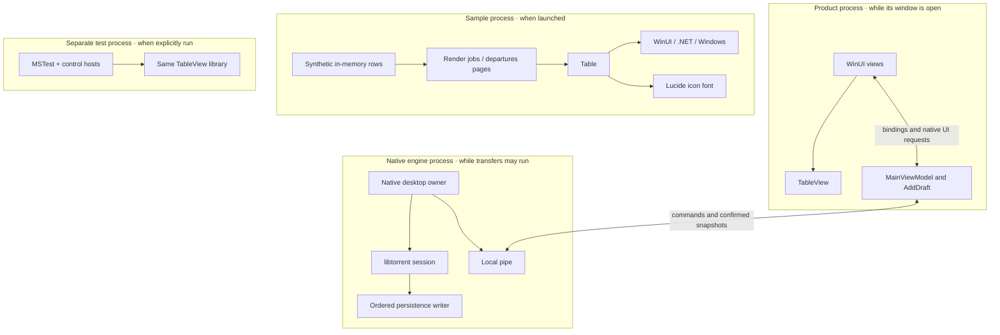
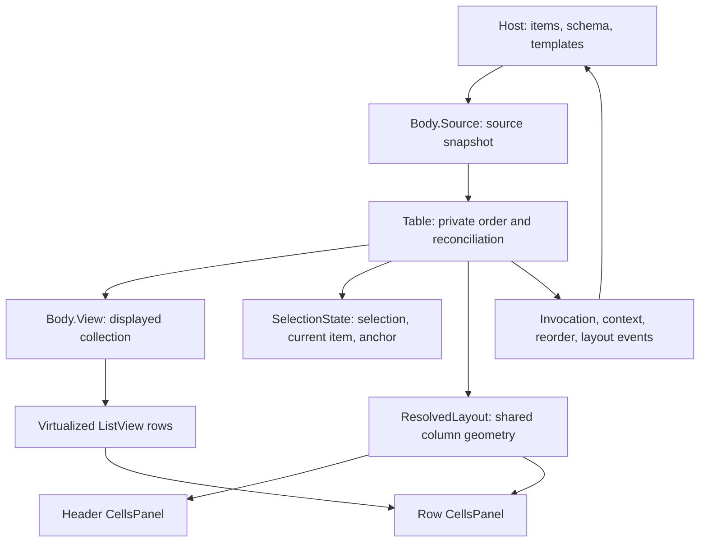

# Current architecture

Source review, 2026-10-04. This describes what exists in **TinyTorrent2**, not the
earlier application in `../TinyTorrent`. The [target architecture](architecture.md)
owns the intended product design and its [open decisions](architecture.md#decisions-still-open).
The first download path has Release builds, production checks and a hands-on
review recorded in [implementation evidence](implementation.md).

## What exists

The reusable WinUI table library lives in `lib/TableView/`, with its two
development hosts in `lib/TableView/sample/` and `lib/TableView/tests/`.
[TinyTorrent.slnx](../TinyTorrent.slnx) includes these projects, Lucide, and a
native engine and product WinUI host. Its [entry point](../engine/src/Main.cpp)
claims one logon-scoped engine and starts the native desktop owner. The first
usable `.torrent` download path and everyday torrent actions are implemented; the later implementation
milestones remain work in progress.

| Existing project | Role | Project dependency |
| --- | --- | --- |
| [Engine](../engine/src/Engine.vcxproj) | Native transfer state, persistence, pipe, tray, splash and lifetime. | libtorrent and native dependencies from `3rdParty/`; no WinUI or .NET. |
| [TinyTorrent](../app/src/TinyTorrent.csproj) | On-demand product window and display/draft state. | TableView, WinUI and .NET; one pipe to Engine. |
| [TableView](../lib/TableView/src/TableView.csproj) | Reusable `Table` control, templates, and English text. | WinUI and Lucide; no torrent application dependency. |
| [Lucide](../lib/Lucide/src/Lucide.csproj) | Lucide icon font and glyph names. | WinUI. |
| [TableViewSample](../lib/TableView/sample/TableViewSample.csproj) | Desktop demonstrations and diagnostic probes. | TableView. |
| [TableViewTests](../lib/TableView/tests/TableViewTests.csproj) | Desktop MSTest host for control behavior. | TableView. |

The sample and tests are development hosts; TableView and Lucide load inside
their host process. The product uses the same TableView public API. The engine
restores durable membership and intent, safely commits additions before allowing
payload transfer, and checkpoints through one storage writer. Closing the product
exits its process while the engine and tray remain. Appearance choices use the
saved settings owner and embedded catalogues in each process.

The product follows MVVM: `MainViewModel` owns display collection, selection,
commands, settings and connection feedback; `AddDraft` owns unfinished input and
addition operations. `MainWindow` retains native pickers, dialog lifetime, chrome,
focus and TableView gestures. Property and command bindings connect those owners.

The project files own framework, platform, and package choices. The sample and
test hosts declare unpackaged deployment. TableView carries its own English
text in an embedded `en.json`. The target product's
[installation plan](architecture.md#installation-and-updates) selects unpackaged
deployment; its installer and prerequisite delivery are not implemented here.

## Build integration

The root solution builds the native and managed projects together through Visual
Studio MSBuild. [TableView.slnx](../lib/TableView/TableView.slnx) contains only
the control, Lucide, and the control's development hosts. Both solutions select
x64. Broader platform lists in individual C# projects do not establish additional
product release targets.

[Directory.Build.props](../Directory.Build.props) owns the `artifacts/` root and
the managed output layout. It excludes generated folders from source inputs so
repeated XAML builds cannot consume their own output. The
[native project](../engine/src/Engine.vcxproj) uses that same root for its output
and intermediates.

The native project selects the toolchain and static linking, and includes and
links the libraries in `3rdParty/` that [Dependencies.ps1](../engine/src/Dependencies.ps1)
builds, as [third-party dependencies](architecture.md#third-party-dependencies)
describes. It never starts that script; without a complete installation in
`3rdParty/` the build fails. It reads libtorrent's compile definitions from the libtorrent build,
because they affect libtorrent's ABI. The build files own these choices; a
separate build system is not needed for engine work.

## Sample and host responsibilities

[App](../lib/TableView/sample/App.cs) opens
[MainWindow](../lib/TableView/sample/MainWindow.cs), which navigates
between a render-job table and a departures board. The
[render-job page](../lib/TableView/sample/Jobs/JobsPage.cs)
uses [Jobs.Feed](../lib/TableView/sample/Jobs/Feed.cs);
the [departures page](../lib/TableView/sample/Board/DeparturesPage.cs)
supplies a different row type and presentation. Neither manages torrents.

The host supplies row objects, filtered source order, column definitions, cell
templates, identity and sort selectors, and handlers for domain actions. A table
reorder reports a request to that host; it does not change the host's domain
records. `ColumnLayout` is a snapshot the host can store, not storage owned by the
control. Probe pages are diagnostic material, not a second product interface.

## Inside TableView

The [implementation map](../lib/TableView/docs/tableview-implementation.md) is the
detailed source authority. At the module interface, the host deals with one
`Table`; its partial files share that same control and state.

[Body.Source](../lib/TableView/src/Body/Source.cs) captures the host's
enumeration on the UI thread and subscribes to collection changes.
[Table sorting](../lib/TableView/src/Table/Sorting.cs) derives a private
order; [Body.View](../lib/TableView/src/Body/View.cs) reconciles that
order for the native list. These are presentation projections of the same host
items, not independent domain authorities.

The selection model reconciles object references or supplied stable keys.
Resolved geometry is shared by header and row panels; the table owns horizontal
offset and the body's native scroller owns vertical scrolling. The input arbiter
chooses between a press, marquee selection, and row drag. Its visual helpers do
not choose the gesture. These owners hide real mechanics from both sample hosts;
splitting or merging them merely to change file count would not improve depth.

## Existing gaps and evidence limits

The [implementation map](../lib/TableView/docs/tableview-implementation.md) records
remaining keyboard, automation and RTL work. [Strings](../lib/TableView/src/Strings.cs)
now prepares immutable embedded catalogues with fallback; live column text and
`Table.Strings` refresh existing presentation. Source subscriptions suspend on
unload and resume on reload. The first product builds and live language switches
have runtime evidence in the [implementation record](implementation.md).
Broader source-lifetime and unrealized-row automation scenarios remain separate
from that narrow product journey.

The test project contains control and input checks, not engine, persistence, or
pipe verification. The first milestone's noninteractive run passed 207 checks;
focused engine checks cover framing, failed storage and restart intent.
Source inspection establishes structure and code paths; it does not establish
rendered appearance, accessibility behavior, responsiveness, transfer throughput,
or background memory use. Evidence selection belongs to [testing](testing.md).
