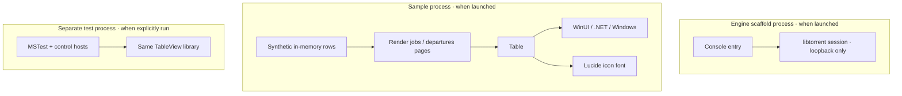
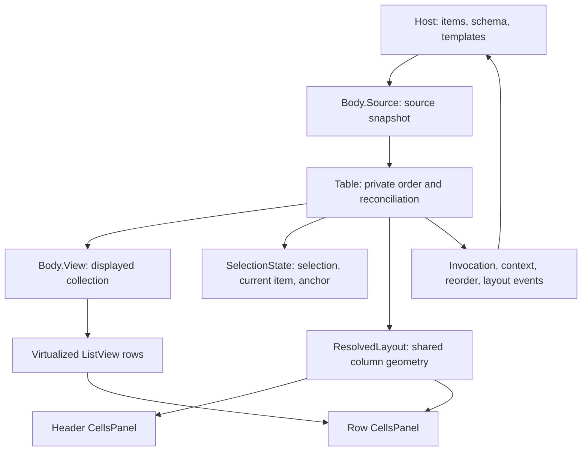

# Current architecture

Source review, 2026-10-04. This describes what exists in **TinyTorrent2**, not the
earlier application in `../TinyTorrent`. The [target architecture](architecture.md)
owns the intended product design and its [open decisions](architecture.md#decisions-still-open).
No build, application, or test host was run for this review.

## What exists

The reusable WinUI table library lives in `lib/TableView/`, with its two
development hosts in `lib/TableView/sample/` and `lib/TableView/tests/`.
[TinyTorrent.slnx](../TinyTorrent.slnx) includes these projects, Lucide, and a
native engine scaffold. Its [entry point](../engine/src/Main.cpp) creates a
libtorrent session, prints its version, and exits. Torrent operations and the
product UI remain unimplemented.

| Existing project | Role | Project dependency |
| --- | --- | --- |
| [Engine](../engine/src/Engine.vcxproj) | Native console scaffold for a libtorrent session check. | libtorrent and its native dependencies through vcpkg; no WinUI or .NET. |
| [TableView](../lib/TableView/src/TableView.csproj) | Reusable `Table` control, templates, and English text. | WinUI and Lucide; no torrent application dependency. |
| [Lucide](../lib/Lucide/src/Lucide.csproj) | Lucide icon font and glyph names. | WinUI. |
| [TableViewSample](../lib/TableView/sample/TableViewSample.csproj) | Desktop demonstrations and diagnostic probes. | TableView. |
| [TableViewTests](../lib/TableView/tests/TableViewTests.csproj) | Desktop MSTest host for control behavior. | TableView. |

The sample and tests are development hosts; TableView and Lucide load inside
their host process. The engine scaffold restricts listening to loopback and
disables discovery and port mapping for its session check. It does not add
torrents or implement the planned named pipe, persistence, tray, or product
splash. `app/` currently contains product instructions, with no WinUI project.
The session check's temporary settings do not define product transfer policy.

The project files own framework, platform, and package choices. The sample and
test hosts declare unpackaged deployment. TableView carries its own English
text in an embedded `en.json`. The target product's
[installation plan](architecture.md#installation-and-updates) selects unpackaged
deployment; its installer and prerequisite delivery are not implemented here.

## Build integration

The root solution builds the native and managed projects together through Visual
Studio MSBuild. [TableView.slnx](../lib/TableView/TableView.slnx) contains only
the control, Lucide, and the control's development hosts. Both solutions select
x64. Broader platform lists in individual C# projects do not establish additional
product release targets.

[Directory.Build.props](../Directory.Build.props) owns the `artifacts/` root and
the managed output layout. It excludes generated folders from source inputs so
repeated XAML builds cannot consume their own output. The
[native project](../engine/src/Engine.vcxproj) uses that same root for its output,
intermediates, and vcpkg libraries and downloads. Relocating vcpkg's registry
cache also needs `X_VCPKG_REGISTRIES_CACHE` to point to
`artifacts\vcpkg_registries`; the project does not set that user environment value.

The native project selects the toolchain and static linking and imports Visual
Studio's vcpkg integration. Its [manifest](../engine/src/vcpkg.json) pins the
dependency baseline and disables libtorrent's default features to exclude
WebTorrent. Native compile definitions live in the project and must match the
package's exported definitions because they affect libtorrent's ABI. The build
files own these choices; a separate build system is not needed for engine work.

## Sample and host responsibilities

[App](../lib/TableView/sample/App.cs) opens
[MainWindow](../lib/TableView/sample/MainWindow.cs), which navigates
between a render-job table and a departures board. The
[render-job page](../lib/TableView/sample/Jobs/JobsPage.cs)
uses [Jobs.Feed](../lib/TableView/sample/Jobs/Feed.cs);
the [departures page](../lib/TableView/sample/Board/DeparturesPage.cs)
supplies a different row type and presentation. Neither manages torrents.

The host supplies row objects, filtered source order, column definitions, cell
templates, identity and sort selectors, and handlers for domain actions. A table
reorder reports a request to that host; it does not change the host's domain
records. `ColumnLayout` is a snapshot the host can store, not storage owned by the
control. Probe pages are diagnostic material, not a second product interface.

## Inside TableView

The [implementation map](../lib/TableView/docs/tableview-implementation.md) is the
detailed source authority. At the module interface, the host deals with one
`Table`; its partial files share that same control and state.

[Body.Source](../lib/TableView/src/Body/Source.cs) captures the host's
enumeration on the UI thread and subscribes to collection changes.
[Table sorting](../lib/TableView/src/Table/Sorting.cs) derives a private
order; [Body.View](../lib/TableView/src/Body/View.cs) reconciles that
order for the native list. These are presentation projections of the same host
items, not independent domain authorities.

The selection model reconciles object references or supplied stable keys.
Resolved geometry is shared by header and row panels; the table owns horizontal
offset and the body's native scroller owns vertical scrolling. The input arbiter
chooses between a press, marquee selection, and row drag. Its visual helpers do
not choose the gesture. These owners hide real mechanics from both sample hosts;
splitting or merging them merely to change file count would not improve depth.

## Existing gaps and evidence limits

Known contract gaps include
[live localisation](../lib/TableView/docs/tableview-implementation.md#known-localisation-gap)
and the [source-lifetime, keyboard, and automation issues](../lib/TableView/docs/tableview-implementation.md#other-known-integration-gaps)
recorded in the implementation map.
[Strings](../lib/TableView/src/Resources/Strings.cs) reads the library's embedded
[English text](../lib/TableView/src/Resources/en.json) once.
[Column.DisplayName](../lib/TableView/src/Column.cs) has no change
notification, and generated headers copy presentation text when built. The
language selection and refresh path are not present. Embedded English does not
establish live language switching.

The test project contains control and input checks, not engine, persistence, or
pipe verification. Its existence is not a claim that the suite currently passes.
Source inspection establishes structure and code paths; it does not establish
rendered appearance, accessibility behavior, responsiveness, transfer throughput,
or background memory use. Evidence selection belongs to [testing](testing.md).
