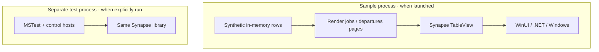
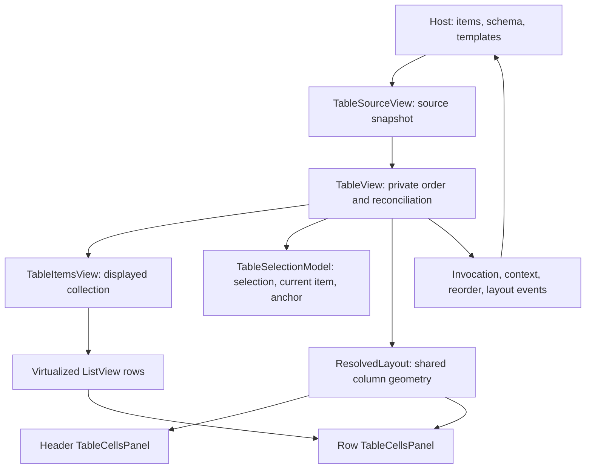

# Current architecture

Source review, 2026-10-03. This describes what exists in **TinyTorrent2**, not the
earlier application in `../TinyTorrent`. The [target architecture](architecture.md)
owns the intended product design and its [open decisions](architecture.md#decisions-still-open).
No application or test host was run for this review.

## What exists

This checkout is a reusable WinUI table library with two development hosts. It
does not yet contain a working torrent application. The complete project list
is in [Synapse.slnx](../winui3/Synapse.slnx).

| Existing project | Role | Project dependency |
| --- | --- | --- |
| [Synapse](../winui3/src/Synapse/Synapse.csproj) | Reusable `TableView`, templates, resources, and icons. | WinUI; no torrent application dependency. |
| [Synapse.Sample](../winui3/samples/Synapse.Sample/Synapse.Sample.csproj) | Desktop demonstrations and diagnostic probes. | Synapse. |
| [Synapse.Tests](../winui3/tests/Synapse.Tests/Synapse.Tests.csproj) | Desktop MSTest host for control behavior. | Synapse. |

These are development executables, not the proposed engine/UI pair. Synapse
loads inside its host process. There is no engine executable, libtorrent build,
named-pipe implementation, torrent persistence, tray, product splash, or product
WinUI host in this checkout. The planned `engine/` and `resources/locales/`
directories do not exist.

The project files own framework, platform, and package choices. Both executables
currently declare unpackaged deployment. The library carries its own English
resources and Lucide font. The
[shared build properties](../winui3/Directory.Build.props) exclude generated XAML
outputs from source inputs. The target product's
[installation plan](architecture.md#installation-and-updates) selects unpackaged
deployment; its installer and prerequisite delivery are not implemented here.

## Sample and host responsibilities

[App](../winui3/samples/Synapse.Sample/App.xaml.cs) opens
[MainWindow](../winui3/samples/Synapse.Sample/MainWindow.xaml.cs), which navigates
between a render-job table and a departures board. The
[render-job page](../winui3/samples/Synapse.Sample/Demo/TableDemoPage.xaml.cs)
uses [DemoFeed](../winui3/samples/Synapse.Sample/Demo/DemoFeed.cs);
the [departures page](../winui3/samples/Synapse.Sample/Board/DeparturesPage.xaml.cs)
supplies a different row type and presentation. Neither manages torrents.

The host supplies row objects, filtered source order, column definitions, cell
templates, identity and sort selectors, and handlers for domain actions. A table
reorder reports a request to that host; it does not change the host's domain
records. `TableLayout` is a snapshot the host can store, not storage owned by the
control. Probe pages are diagnostic material, not a second product interface.

## Inside Synapse

The [implementation map](../winui3/docs/tableview-implementation.md) is the
detailed source authority. At the module interface, the host deals with one
`TableView`; its partial files share that same control and state.

[TableSourceView](../winui3/src/Synapse/TableSourceView.cs) captures the host's
enumeration on the UI thread and subscribes to collection changes.
[TableView sorting](../winui3/src/Synapse/TableView.Sorting.cs) derives a private
order; [TableItemsView](../winui3/src/Synapse/TableItemsView.cs) reconciles that
order for the native list. These are presentation projections of the same host
items, not independent domain authorities.

The selection model reconciles object references or supplied stable keys.
Resolved geometry is shared by header and row panels; the table owns horizontal
offset and the body's native scroller owns vertical scrolling. The input arbiter
chooses between a press, marquee selection, and row drag. Its visual helpers do
not choose the gesture. These owners hide real mechanics from both sample hosts;
splitting or merging them merely to change file count would not improve depth.

## Existing gaps and evidence limits

Known contract gaps include
[live localisation](../winui3/docs/tableview-implementation.md#known-localisation-gap)
and the [source-lifetime, keyboard, and automation issues](../winui3/docs/tableview-implementation.md#other-known-integration-gaps)
recorded in the implementation map.
[TableResources](../winui3/src/Synapse/TableResources.cs) reads the library's
[English resources](../winui3/src/Synapse/Strings/en-US/Resources.resw) through a
static loader. [TableColumn.DisplayName](../winui3/src/Synapse/TableColumn.cs)
has no change notification, and generated headers copy presentation text when
built. The shared catalogue generator and language refresh path are not present.
Resource-backed English does not establish live language switching.

The test project contains control and input checks, not engine, persistence, or
pipe verification. Its existence is not a claim that the suite currently passes.
Source inspection establishes structure and code paths; it does not establish
rendered appearance, accessibility behavior, responsiveness, transfer throughput,
or background memory use. Evidence selection belongs to [testing](testing.md).
