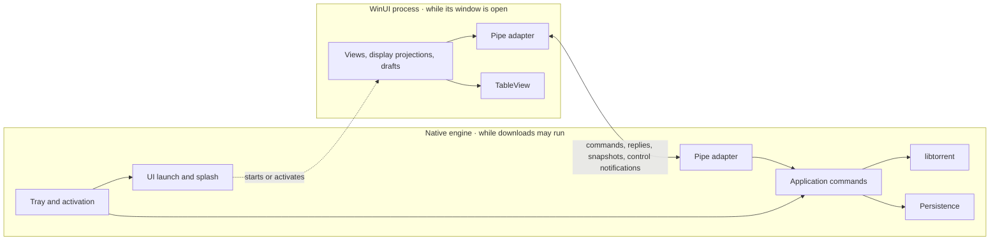

# Target architecture

Selected design, updated 2026-10-04. TinyTorrent will be a Windows desktop
torrent client with one native libtorrent engine, an on-demand WinUI 3 interface,
one local pipe, and the shared TableView control library. These are implementation
targets; the [current architecture](architecture-current.md) records what exists.
[Decisions still open](#decisions-still-open) lists the remaining choices, and
the [documentation guide](README.md) identifies each contract's authority.

## Usability comes first

Common sense, ease of use, and intuitive behavior take precedence over other
design preferences in these plans. The contracts and implementation exist to
serve the person's task. Prefer familiar actions, sensible defaults, and
automatic handling of routine work; change a mechanism that adds avoidable steps
or exposes internal bookkeeping. Ask the user to decide only when their intent
is ambiguous or proceeding would risk their files or discard unfinished work.

Follow Microsoft's Fluent 2 principles through native Windows and WinUI patterns.
When inherited visual rules conflict with clarity, accessibility, or familiar
platform behavior, resolve the conflict at the rule's owner. The
[interface contract](interface.md#native-controls-and-visual-authority) owns the
concrete presentation guidance.

## Product and scope

TinyTorrent is a small, fast client that does the everyday torrent tasks well
and nothing more. A feature earns its place by an everyday need; one that adds
weight for a few users stays out. No other client's feature list is a reason to
add a feature.

The product manages local downloads and seeds. It supports magnet and torrent-file
addition, including several sources at once and drag-and-drop, metadata preview,
destination and file choices, paused addition, duplicate detection with tracker
merging, pause/resume, force start, queue order, global and alternative speed
limits, scheduled pauses and speed limits, peer limits, seeding policies,
verification, relocation, a `.!tt` suffix on unfinished files so a file with
its real name is always finished, and distinct
remove versus delete-data actions. It opens downloaded files and folders, copies
magnet links and info hashes, and finds torrents by text or isolates errors. It exposes
useful errors and on-demand files, peers, trackers, pieces, and speed
information, including tracker editing and reannounce. Keyboard use,
accessibility, shell activation, and recovery after restart are part of the product.

Design the interface around these tasks and libtorrent's capabilities. Remote
servers, browser access, interchangeable engines, other platforms, a search
panel, and torrent creation are outside scope. History, blocklists, and
automation, such as a watched folder or running a program when a download
finishes, need an identified user requirement before they become implementation
work. The initial release includes automatic port mapping (UPnP/NAT-PMP), an
editable listen port, binding torrent traffic to one network interface such as a
VPN, notifications, preventing idle sleep while downloading on mains power, and
an update check. Port mapping, notifications about problems, idle-sleep
prevention while downloading, and the update check start enabled and can be
turned off; notifications about finished and added downloads start disabled.
Encryption follows libtorrent's defaults without a separate setting. Proxy
configuration is outside the initial scope.

A setting exists only where people need different behavior. When one answer
is right for nearly everyone, it is fixed behavior; when no one has shown a
problem, there is neither. Engine tuning, diagnostics, cosmetic choices, and
protocol internals therefore stay fixed until a demonstrated workflow needs
otherwise, because every setting is read by everyone and its saved key is
permanent.

Several torrents can use the same files, so the same content can be seeded from
several trackers, as established clients allow. The
[shared-files policy](engine.md#shared-files) keeps file deletion and relocation
from reaching another torrent's files. Automatic replacement of an existing
torrent is outside the initial scope.

## Two processes, one download authority

The native engine remains running while downloads may run. It contains libtorrent,
persistence, the tray, the splash window, and the local pipe endpoint. Opening the
interface starts or activates a separate WinUI process; closing its window lets
that process exit while transfers continue.



Two processes allow the UI runtime to disappear and a UI crash to leave transfers
running. A measurement on 2026-10-04 sized the first reason: a minimal
unpackaged WinUI window (Windows App SDK 2.4, .NET 10, Release, a 200-row list)
whose process stays alive after the window closes keeps about 32 MB private
working set, the figure Task Manager shows, and about 97 MB private commit.
Hiding the window frees almost nothing. Trimming the working set drops it to
2 MB, but it grew back to 5 MB within 30 idle seconds, and the commit stays. Two
processes keep that cost out of start at sign-in and out of the closed-window
state this product measures first. The second reason is real too: WinUI ends
its process on an unhandled UI exception, and in one process that would stop
every download. The price is a cold WinUI start on every Open, which the splash
covers, and the pipe with its reconnect path. The first milestone's
[resource check](testing.md#resource-checks) measures the time from Open to a
usable window; a slow open is a reason to revisit this split.

A separate tray process would add another resident executable and
supervision path without earning its cost. The engine loads neither .NET nor
WinUI. It builds as one executable; focused native checks can link the same
implementation units. Its startup, commands, and shutdown also work without tray
windows or UI files, so headless checks use the production implementation.

| Responsibility | Sole owner |
| --- | --- |
| Swarm and transfer execution, torrent metadata | libtorrent inside the engine |
| Application commands, torrent membership, queue and transfer policy | Engine |
| Durable identities, saved settings, resume checkpoints | Engine persistence |
| File operations and their recovery | Engine |
| Tray, splash, activation routing, UI launch, application lifetime | Engine |
| File/link handler and start-at-sign-in registration | Engine registration owner |
| Installation files, prerequisites, shortcuts, and uninstall entry | Installer |
| Background preferences and selected application language | Engine |
| Framing, decoding, request correlation, connection failures | Pipe adapter at each endpoint |
| Display copies, filters, drafts, dialogs, window placement, UI-only preferences | WinUI |
| Table geometry, sorting, selection, and gestures | TableView |
| Resource lookup and live text refresh | One localisation component per process, following the [localisation contract](localisation.md#ownership-and-live-behavior) |

Keep work together when it changes together. Use a small interface that hides
a real decision; remove forwarding layers that add no policy or useful isolation. Add an
abstraction when a concrete caller needs it, not to permit hypothetical engines,
platforms, or test substitutes.

Immutable snapshots, saved checkpoints, and display projections serve different
lifetimes under the same state authority. Two language codecs implement the same
protocol.

## Command and presentation flow

Tray actions and pipe requests call the same engine operations. Transport checks
belong to the adapter; torrent-state validation and download policy belong to the
engine. The tray does not call its own process through IPC.

WinUI uses MVVM. `MainViewModel` owns the window's presentation state, selection,
command availability, and commands through one concrete pipe client. `AddDraft`
owns unfinished addition choices and preview state. Views bind to those owners;
they retain native pickers, dialogs, window chrome, and control-specific focus
and scrolling. View models use `INotifyPropertyChanged` and `ICommand` directly,
without a new framework, service interface, or second torrent database. This
keeps gestures on one command path and stops control lifetime from owning edits.

WinUI presents confirmed state and pending work. File pickers, clipboard actions,
and opening Explorer use Windows directly; changes to engine-owned files go
through the engine.

The product host maps a completed engine snapshot into display rows keyed by
durable torrent identity, then supplies its filtered projection to TableView.
Keep row instances stable and apply live property updates on the UI dispatcher,
following the [TableView update contract](../lib/TableView/docs/tableview-contract.md#53-source-identity-and-update-contract).
Replacing the source on every transfer tick would cancel queue dragging;
ordinary telemetry updates the row values. Table sorting changes presentation
order; a queue reorder event becomes a
request to the engine's command owner. Selection and drafts remain presentation
state, reconciled against confirmed membership.

The close/reopen path makes the intended lifetime visible:

```mermaid
sequenceDiagram
    actor User
    participant Engine as Native engine
    participant UI as WinUI process
    User->>Engine: Open application
    Engine->>UI: Start or activate window
    UI->>Engine: Connect and request snapshot
    Engine-->>UI: Confirmed state and session identity
    UI->>Engine: Torrent command
    Engine-->>UI: Acceptance or rejection
    UI->>Engine: Request outcome / refreshed state
    Engine-->>UI: Pending, completed, or failed
    User->>UI: Close window
    Note over UI: Close normally; protect unfinished input if present
    Note over Engine: Transfers and persistence continue
    User->>Engine: Open again
    Engine->>UI: Start window
    UI->>Engine: Reconnect and reconcile snapshot
```

Application Exit follows the coordinated [shutdown](engine.md#closing-and-shutdown)
path.

## Reuse and source layout

| Location | Purpose |
| --- | --- |
| `engine/src/` | Existing native project and libtorrent session check; extend it for the First usable download milestone. |
| `engine/inc/` | The native project's headers. Includes name a header from this root, such as `Engine/State.h`. |
| `app/` | Product instructions exist; add the WinUI host for the First usable download milestone. |
| `lib/TableView/` | Existing reusable control library and the only TableView: the library in `src/`, focused verification in `tests/`, and a demonstration host in `sample/`. |
| `lib/Lucide/` | The Lucide icon font and its glyph names, for any WinUI project. |
| `resources/` | Product branding: the application icon and logo. |
| `artifacts/` | Generated output, kept outside source inputs to prevent recursive copies. Current routing is described in [build integration](architecture-current.md#build-integration). |
| `3rdParty/` | The engine's dependencies, compiled once; not in git. See [third-party dependencies](#third-party-dependencies). |

Use [TinyTorrent.slnx](../TinyTorrent.slnx) and its existing MSBuild projects.
The sample and tests reference [TableView.csproj](../lib/TableView/src/TableView.csproj),
which produces `TableView.dll`; the product host will reference it too. The
library owns its templates and English text and has no engine dependency.

Build the product UI from the [interface contract](interface.md), using the
selected engine and pipe design and the existing TableView and Lucide libraries.
No screen from the earlier product is selected for reuse, and the implementation
milestones do not depend on importing that UI.

Keep the original `../TinyTorrent` repository untouched as reference material.
Source inspection has not established that adopting its screens would improve
this product; their usability, responsiveness, and accessibility remain
unverified here. Reusing a specific part needs a concrete benefit supported by
review of its behavior, dependencies, and adaptation cost. That decision belongs
to the affected implementation; it is not a required migration task. Verify the
resulting interaction under [testing](testing.md), whether its code is new or
adapted. Keep one product host and reference TableView.
Transmission, its daemon supervisor and RPC client, TypeScript concepts, browser
architecture, and web state models do not define this product.

## Dependencies and cost

Runtime memory while downloading or seeding with WinUI closed is the primary
resource measure. Correctness, durable downloads, required features, and useful
throughput remain constraints. Package size is secondary. Closing WinUI releases
its process and engine work retained solely for that UI.

Retain libtorrent and the networking/crypto dependencies needed for torrent
interoperability. Removing application HTTP/RPC does not remove HTTPS trackers,
web seeds, incoming peer connections, TCP/uTP, or useful discovery.

The [native project](../engine/src/Engine.vcxproj) defines the toolchain, x64
target and static linking, and [Dependencies.ps1](../engine/src/Dependencies.ps1)
pins the dependency versions and feature selection, as
[third-party dependencies](#third-party-dependencies) describes. Extend that build
for engine implementation. When updating dependencies, check the latest stable
[upstream release](https://github.com/arvidn/libtorrent/releases/latest)
independently of `../TinyTorrent`, pin the selected version and feature set,
and recheck version-sensitive engine assumptions. Pinning keeps builds reproducible.
The automatic disk policy is recorded in [engine settings](engine.md#disk-write-caching).
Runtime packages need a concrete job; test frameworks and build tools stay out
of the shipped dependency graph.

Remove unnecessary retained work and duplicate data before constraining useful
transfer buffers or peer activity. Bound queues and retained data at their existing
owners. Each worker has identifiable blocking work and an idle wait. DLLs, shared
runtime installations, and single-file bundles do not by themselves prove lower
running memory.

### Third-party dependencies

vcpkg is no longer acceptable, by the owner's ruling. Visual Studio's vcpkg
integration runs `vcpkg install` on every build. When any input to its package
fingerprint changes, such as the compiler, CMake, PowerShell or a port script, it
deletes every installed library and compiles Boost, OpenSSL and libtorrent again
in the middle of an ordinary build. This happened and destroyed the installed
libraries.

The engine's dependencies are therefore git checkouts at pinned tags. They are
compiled once and are never downloaded or compiled again until someone changes a
pin. [Dependencies.ps1](../engine/src/Dependencies.ps1) owns the pins and creates
`3rdParty/` at the repository root:

- the checkouts of libtorrent, OpenSSL, Boost (headers only) and nlohmann/json;
- `tools/`: Strawberry Perl and NASM, which OpenSSL's build needs and Visual Studio
  does not include, downloaded from their official sources and checked against a
  pinned SHA-256;
- `Release/` and `Debug/`: the static libraries and headers the engine links, and
  libtorrent's exported compile definitions.

Git ignores `3rdParty/`. It is outside `artifacts/`, so cleaning build output never
forces the dependencies to be compiled again. Only the repository owner runs the
script; a build never starts it. When `3rdParty/` holds no complete installation,
the engine build fails and names the script, so a build after `3rdParty/` was moved
or removed cannot download and compile everything again. Run on a complete
installation without `-Update`, the script does nothing. An ordinary build never
downloads or compiles a dependency, even after a compiler, CMake or Visual Studio
update. The libraries are compiled without `/GL`, because a library compiled with
`/GL` refuses to link after a compiler update and a library compiled without it
links with every later compiler.

The engine takes libtorrent's compile definitions from the libtorrent build in
`3rdParty/` instead of keeping its own list. A definition that differs from the
library's changes libtorrent's types under the engine and corrupts memory at
runtime with no build error.

To change a pinned version:

1. Change the tag, the build options, or a tool's URL and SHA-256 in
   `Dependencies.ps1`.
2. Run `powershell -ExecutionPolicy Bypass -File engine\src\Dependencies.ps1 -Update`.
   It fetches the new version and rebuilds that library and every library built
   against it. The other dependencies stay as they are.
3. Build the engine and recheck version-sensitive engine assumptions.

To rebuild everything deliberately, delete `3rdParty/` and run the script.

## Installation and updates

Ship an unpackaged application with a small per-user Inno Setup installer from
the project's release page. The Microsoft Store is not required. Use
[non-administrative install mode](https://jrsoftware.org/ishelp/topic_setup_privilegesrequired.htm)
for the application under `%LOCALAPPDATA%\Programs\TinyTorrent`; engine data
lives separately under `%LOCALAPPDATA%\TinyTorrent`. Resolve these locations
through Windows known folders.

Publish WinUI as framework-dependent. Ship the engine, product host, TableView,
resources, and required application dependencies, without app-local copies of
the shared WinUI or .NET runtimes. Before launch, the installer checks for
exactly the runtimes the release needs, following the
[unpackaged deployment guide](https://learn.microsoft.com/en-us/windows/apps/windows-app-sdk/deploy-unpackaged-apps),
reuses compatible installed ones, and fetches missing ones from Microsoft's
official distribution. Prerequisite installation can need elevation or be blocked by machine policy;
report that outcome instead of promising every machine a no-admin installation.
Cancelling a prerequisite must leave a retryable installation, not launch a
broken UI. Updating TinyTorrent does not redownload an already compatible runtime.

First installation offers opening torrents with TinyTorrent, selected by
default, and starting at sign-in, not selected by default, because people do not
expect a torrent client to start and upload at sign-in unless they asked for it.
Setup performs the registration and, when
Windows requires the person's default-app choice, takes them to that choice.
Declining it leaves the application installed and usable. The installer calls
the engine's [registration operations](engine.md#windows-registration);
Preferences calls the same owner. Upgrades preserve disabled registrations and
existing default-app choices without repeating setup prompts. The installer owns
the engine-targeting shortcut and Installed apps entry, not a second handler writer.
Uninstall requests coordinated Exit, unregisters TinyTorrent, and removes its
program files. It leaves downloads, saved engine data, and shared runtimes intact.

The installer does not silently add firewall rules or change network profiles.
[Windows Firewall](https://learn.microsoft.com/en-us/windows/security/operating-system-security/network-security/windows-firewall/rules)
may prompt for inbound access; a prompt or approval is not guaranteed by policy
or account permissions. Continue using available outgoing connections when
inbound access is blocked. Port mapping does not bypass the host firewall.

Updates use the same release installer, after the coordinated
[Exit](engine.md#closing-and-shutdown). When TinyTorrent was running before the
update, the installer starts it again, so downloads do not stay stopped until
the person remembers to open it. Stage and validate a complete release
before replacing it; never launch an engine/UI pair from different releases.
Keep an interrupted update recoverable without modifying downloads.

Without an update check, most installations keep an old libtorrent and its known
network-facing defects. When the window opens, WinUI asks the project's release
page for the latest version, at most once a day, unless the Check for updates
preference is off. A newer release shows Update available in the window, which
opens the release page; installing it is the person's action. There is no silent
update, resident updater, or check while the window is closed.

WinUI stores the last attempt and known release version in `updates.json`
beside its window layout. The check uses the project's public latest-release
API, without credentials, with an eight-second limit. Cache the attempt before
requesting, including an unsuccessful attempt, so reopening an offline window
does not repeat the request within 24 hours. Unavailable releases and network
failures do not interrupt torrent work. Turning the preference off or closing
WinUI cancels a pending request. The update command opens only the project's
release page, never a download URL supplied in a reply.

Sign public release artifacts; validate installation, upgrade, and uninstall
with the chosen prerequisites before publication. A future winget listing can
reference this same installer without becoming a Store dependency.

## First implementation

The [existing projects](architecture-current.md#build-integration) implement
the first usable download path; [the implementation record](implementation.md)
holds its checks, measurements and review findings. This plan establishes the
remaining work in order. The first path uses a `.torrent` file, destination choice,
Add, live progress in TableView, and Pause/Resume. Include saved membership and
intent, basic process launch, close/reopen, disconnect feedback, and a minimal
tray icon with Open and Exit: closing the window leaves the engine running, so
the user needs a way to reopen the window and to stop the engine.

Implement the engine operations and pipe messages that this path needs, then
connect the first WinUI screen. TableView API polish can proceed alongside the
engine work; integrate through the agreed public API. Resolve the
[control gaps affecting that screen](../lib/TableView/docs/tableview-implementation.md#keyboard-and-automation-integration)
before treating its interaction as complete. Design each journey against the
[interface contract](interface.md), keeping implementation tied to a real caller.
The [testing policy](testing.md) governs evidence and desktop execution.

| Milestone | What it establishes | Completion evidence |
| --- | --- | --- |
| First usable download | The narrow path above: libtorrent state, durable identity, one command and persistence owner, [safe addition](engine.md#addition-and-identity), and [bounded diagnostics](engine.md#diagnostics). One pipe connects the WinUI host to that engine, and a minimal tray icon offers Open and Exit. Use [text catalogues](localisation.md#one-catalogue-per-project) from the first screen. | Add a real torrent, see progress, pause and resume. Closing WinUI leaves the transfer running; Open from the tray restores confirmed state, and Exit stops the engine. Membership and intent survive engine restart; failed storage is not reported as saved. Complete a hands-on [journey review](interface.md#implementation-review) with pointer and keyboard and the first [resource check](testing.md#resource-checks) before expanding the UI. |
| Everyday torrent actions | Extend the same Add path with magnet metadata preview and file choices, several sources in one form, drag-and-drop and paste, and tracker merging for duplicates. Then add queue ordering, force start, verification, Remove keeping files, text search and the Errors shortcut, the [main window commands](interface.md#main-window), and the global and alternative speed limits. Establish the [preview guard](engine.md#addition-and-identity) before acquiring magnet metadata. | Preview writes no payload; cancellation and duplicates preserve existing downloads. Intended choices reach the engine. Thirty torrent files opened from Explorer arrive in one Add form. A confirmed removal stays removed after restart while its files remain. Reconnect reconciles pending work without silently repeating uncertain commands. |
| Background and desktop behavior | Complete tray, activation, splash, startup failure feedback, coordinated Exit, and [Windows registration](engine.md#windows-registration). Add the scoped completion and error notifications, the first-close notice, and idle-sleep behavior. | Tray and launch actions reach the same engine; engine restart reattaches a surviving UI; saved work survives shutdown and Exit protects unfinished input. Registration uses one owner. Notifications and sleep behavior work with WinUI closed. |
| Details and preferences | Add the [inspector journeys](interface.md#inspector-and-edits) and [Preferences](interface.md#preferences), one task at a time. Include file choices and priorities, trackers, peer information, speed/pieces visuals, live language switching, and RTL header navigation. | Committed choices apply without unnecessary save prompts; real drafts survive failed edits. Hidden views stop detail work. The Speed view shows transfer from while WinUI was closed. Switching languages updates existing surfaces, controls, and tray without losing input or breaking keyboard navigation; the [live-switch exercise](localisation.md#cost-and-proportionate-evidence) proves it. Review each adopted surface in use. |
| Move and delete files | Relocation and explicit delete-data, following [removal and relocation](engine.md#removal-and-relocation) and the [shared-files policy](engine.md#shared-files). | A destination collision is reported, not replaced. A move interrupted by a crash leaves the torrent paused with Move interrupted instead of downloading again. Neither deletion nor relocation reaches the files of a torrent outside the command; cross-seeded torrents move and delete together. |
| Distribution | The selected [installer and runtime delivery](#installation-and-updates). | Complete the whole-application [resource and release checks](testing.md#resource-checks), fresh installation with missing prerequisites, preserved preferences on upgrade, taskbar/handler/sign-in activation, and safe uninstall; no downloads or shared runtimes removed. |

Choose concrete message fields and project boundaries as that path requires
them. Add complexity only after naming the behavior that the simpler
arrangement cannot provide.

Revisit a decision when evidence contradicts its reason. A single process would
keep the measured WinUI cost resident; shared memory would add synchronisation
and lifetime costs.
Neither is needed now. If custom serialization or lifecycle code becomes harder
to maintain than a platform facility, reconsider that choice at its owner rather
than wrapping it in more layers.

## Decisions still open

Resolve each decision before its dependent work, then record the choice at its
owner and update this live list. Continue independent implementation work while
unrelated questions remain open.

| Decision | When it matters | Owner |
| --- | --- | --- |
| Release prerequisites and installation mechanics | With the first release build. Pin supported runtime versions/architectures and official downloads, signing configuration, and recoverable upgrade ordering for the selected installer. | [Installation and updates](#installation-and-updates) |
| Preferences, screen layouts, and tray contents | Before each affected journey. Choose the controls needed for the agreed scope. | [Product scope](#product-and-scope), [engine](engine.md), and [interface](interface.md) |
| Table row appearance | With hands-on testing before product integration. Review row hover, selection accent, corner shape, and focus treatment. Retain the existing appearance until that review; invisible keyboard location remains an accessibility gap. | [TableView visual contract](../lib/TableView/docs/tableview-contract.md#8-rendering-layout-and-visual-language) |
