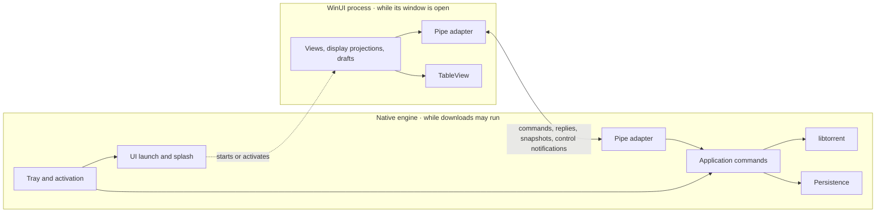

# Target architecture

Selected design, updated 2026-10-04. TinyTorrent will be a Windows desktop
torrent client with one native libtorrent engine, an on-demand WinUI 3 interface,
one local pipe, and the shared TableView control library. These are implementation
targets; the [current architecture](architecture-current.md) records what exists.
[Decisions still open](#decisions-still-open) lists the remaining choices, and
the [documentation guide](README.md) identifies each contract's authority.

## Usability comes first

Common sense, ease of use, and intuitive behavior take precedence over other
design preferences in these plans. The contracts and implementation exist to
serve the person's task. Prefer familiar actions, sensible defaults, and
automatic handling of routine work; change a mechanism that adds avoidable steps
or exposes internal bookkeeping. Ask the user to decide only when their intent
is ambiguous or proceeding would risk their files or discard unfinished work.

Follow Microsoft's Fluent 2 principles through native Windows and WinUI patterns.
When inherited visual rules conflict with clarity, accessibility, or familiar
platform behavior, resolve the conflict at the rule's owner. The
[interface contract](interface.md#native-controls-and-visual-authority) owns the
concrete presentation guidance.

## Product and scope

The product manages local downloads and seeds. It supports magnet and torrent-file
addition, metadata preview, destination and file choices, paused addition,
duplicate detection, pause/resume, queue order, transfer and peer limits, seeding
policies, verification, relocation, and distinct remove versus delete-data
actions. It exposes useful errors and on-demand files, peers, trackers, pieces,
and speed information, including tracker editing and reannounce. Keyboard use,
accessibility, shell activation, and recovery after restart are part of the product.

Design the interface around these tasks and libtorrent's capabilities. Remote
servers, browser access, interchangeable engines, other platforms, and a search
panel are outside scope. A local torrent filter remains a normal interface
operation. History, automation, and blocklists need an identified user requirement
before they become implementation work. The initial release includes automatic
port mapping (UPnP/NAT-PMP), an editable listen port, completion notifications,
and preventing idle sleep during active downloads on mains power. Port mapping,
notifications, and idle-sleep prevention start enabled and can be turned off.
Encryption follows libtorrent's defaults without a separate setting. Proxy
configuration is outside the initial scope.

The [payload-ownership policy](engine.md#payload-ownership) gives each file one
torrent owner. Simultaneous shared-file seeding and automatic replacement of an
existing torrent are outside the initial scope. Multiple trackers on one torrent
remain supported. Existing files can be reused after their previous torrent is
removed without deleting data and the engine has released its storage claims.

## Two processes, one download authority

The native engine remains running while downloads may run. It contains libtorrent,
persistence, the tray, the splash window, and the local pipe endpoint. Opening the
interface starts or activates a separate WinUI process; closing its window lets
that process exit while transfers continue.



Two processes allow the UI runtime to disappear and a UI crash to leave transfers
running. A separate tray process would add another resident executable and
supervision path without earning its cost. The engine loads neither .NET nor
WinUI. It builds as one executable; focused native checks can link the same
implementation units. Its startup, commands, and shutdown also work without tray
windows or UI files, so headless checks use the production implementation.

| Responsibility | Sole owner |
| --- | --- |
| Swarm and transfer execution, torrent metadata | libtorrent inside the engine |
| Application commands, torrent membership, queue and transfer policy | Engine |
| Durable identities, saved settings, resume checkpoints | Engine persistence |
| Payload ownership during transfers, file operations, and recovery | Engine |
| Tray, splash, activation routing, UI launch, application lifetime | Engine |
| File/link handler and start-at-sign-in registration | Engine registration owner |
| Installation files, prerequisites, shortcuts, and uninstall entry | Installer |
| Background preferences and selected application language | Engine |
| Framing, decoding, request correlation, connection failures | Pipe adapter at each endpoint |
| Display copies, filters, drafts, dialogs, window placement, UI-only preferences | WinUI |
| Table geometry, sorting, selection, and gestures | TableView |
| Resource lookup and live text refresh | One localisation component per process, following the [localisation contract](localisation.md#ownership-and-live-behavior) |

Keep work together when it changes together. Use a small interface that hides
a real decision; remove forwarding layers that add no policy or useful isolation. Add an
abstraction when a concrete caller needs it, not to permit hypothetical engines,
platforms, or test substitutes.

Immutable snapshots, saved checkpoints, and display projections serve different
lifetimes under the same state authority. Two language codecs implement the same
protocol.

## Command and presentation flow

Tray actions and pipe requests call the same engine operations. Transport checks
belong to the adapter; torrent-state validation and download policy belong to the
engine. The tray does not call its own process through IPC.

WinUI presents confirmed state and pending work. File pickers, clipboard actions,
and opening Explorer use Windows directly; changes to engine-owned files go
through the engine.

The product host maps a completed engine snapshot into display rows keyed by
durable torrent identity, then supplies its filtered projection to TableView.
Keep row instances stable and apply live property updates on the UI dispatcher,
following the [TableView update contract](../lib/TableView/docs/tableview-contract.md#53-source-identity-and-update-contract).
Replacing the source on every transfer tick would cancel queue dragging;
ordinary telemetry updates the row values. Table sorting changes presentation
order; a queue reorder event becomes a
request to the engine's command owner. Selection and drafts remain presentation
state, reconciled against confirmed membership.

The close/reopen path makes the intended lifetime visible:

```mermaid
sequenceDiagram
    actor User
    participant Engine as Native engine
    participant UI as WinUI process
    User->>Engine: Open application
    Engine->>UI: Start or activate window
    UI->>Engine: Connect and request snapshot
    Engine-->>UI: Confirmed state and session identity
    UI->>Engine: Torrent command
    Engine-->>UI: Acceptance or rejection
    UI->>Engine: Request outcome / refreshed state
    Engine-->>UI: Pending, completed, or failed
    User->>UI: Close window
    Note over UI: Close normally; protect unfinished input if present
    Note over Engine: Transfers and persistence continue
    User->>Engine: Open again
    Engine->>UI: Start window
    UI->>Engine: Reconnect and reconcile snapshot
```

Application Exit follows the coordinated [shutdown](engine.md#closing-and-shutdown)
path.

## Reuse and source layout

| Location | Purpose |
| --- | --- |
| `engine/src/` | Existing native project and libtorrent session check; extend it for the First usable download milestone. |
| `app/` | Product instructions exist; add the WinUI host for the First usable download milestone. |
| `lib/TableView/` | Existing reusable control library and the only TableView: the library in `src/`, focused verification in `tests/`, and a demonstration host in `sample/`. |
| `lib/Lucide/` | The Lucide icon font and its glyph names, for any WinUI project. |
| `resources/` | Product branding: the application icon and logo. |
| `artifacts/` | Generated output, kept outside source inputs to prevent recursive copies. Current routing is described in [build integration](architecture-current.md#build-integration). |

Use [TinyTorrent.slnx](../TinyTorrent.slnx) and its existing MSBuild projects.
The sample and tests reference [TableView.csproj](../lib/TableView/src/TableView.csproj),
which produces `TableView.dll`; the product host will reference it too. The
library owns its templates and English text and has no engine dependency.

Build the product UI from the [interface contract](interface.md), using the
selected engine and pipe design and the existing TableView and Lucide libraries.
No screen from the earlier product is selected for reuse, and the implementation
milestones do not depend on importing that UI.

Keep the original `../TinyTorrent` repository untouched as reference material.
Source inspection has not established that adopting its screens would improve
this product; their usability, responsiveness, and accessibility remain
unverified here. Reusing a specific part needs a concrete benefit supported by
review of its behavior, dependencies, and adaptation cost. That decision belongs
to the affected implementation; it is not a required migration task. Verify the
resulting interaction under [testing](testing.md), whether its code is new or
adapted. Keep one product host and reference TableView.
Transmission, its daemon supervisor and RPC client, TypeScript concepts, browser
architecture, and web state models do not define this product.

## Dependencies and cost

Runtime memory while downloading or seeding with WinUI closed is the primary
resource measure. Correctness, durable downloads, required features, and useful
throughput remain constraints. Package size is secondary. Closing WinUI releases
its process and engine work retained solely for that UI.

Retain libtorrent and the networking/crypto dependencies needed for torrent
interoperability. Removing application HTTP/RPC does not remove HTTPS trackers,
web seeds, incoming peer connections, TCP/uTP, or useful discovery.

The [native project](../engine/src/Engine.vcxproj) and
[vcpkg manifest](../engine/src/vcpkg.json) now define the toolchain, x64 target,
dependency baseline, static linking, and feature selection. Extend that build
for engine implementation. When updating dependencies, check the latest stable
[upstream release](https://github.com/arvidn/libtorrent/releases/latest)
independently of `../TinyTorrent`, pin the selected baseline and feature set,
and recheck version-sensitive engine assumptions. Pinning keeps builds reproducible.
The automatic disk policy is recorded in [engine settings](engine.md#disk-write-caching).
Runtime packages need a concrete job; test frameworks and build tools stay out
of the shipped dependency graph.

Remove unnecessary retained work and duplicate data before constraining useful
transfer buffers or peer activity. Bound queues and retained data at their existing
owners. Each worker has identifiable blocking work and an idle wait. DLLs, shared
runtime installations, and single-file bundles do not by themselves prove lower
running memory.

## Installation and updates

Ship an unpackaged application with a small per-user Inno Setup installer from
the project's release page. The Microsoft Store is not required. Use
[non-administrative install mode](https://jrsoftware.org/ishelp/topic_setup_privilegesrequired.htm)
for the application under `%LOCALAPPDATA%\Programs\TinyTorrent`; engine data
lives separately under `%LOCALAPPDATA%\TinyTorrent`. Resolve these locations
through Windows known folders.

Publish WinUI as framework-dependent. Ship the engine, product host, TableView,
resources, and required application dependencies, without app-local copies of
the shared WinUI or .NET runtimes. Reuse compatible installed runtimes; fetch
missing prerequisites directly from Microsoft's official distribution. Check
the supported architecture and version before launch. The release's actual
dependency metadata determines which [.NET runtime](https://learn.microsoft.com/en-us/dotnet/core/install/windows)
is needed; WinUI alone does not imply the WPF/Windows Forms Desktop Runtime.
Include required Visual C++ runtime checks from the
[Windows App SDK deployment guide](https://learn.microsoft.com/en-us/windows/apps/windows-app-sdk/deploy-unpackaged-apps).
Prerequisite installation can need elevation or be blocked by machine policy;
report that outcome instead of promising every machine a no-admin installation.
Cancelling a prerequisite must leave a retryable installation, not launch a
broken UI. Updating TinyTorrent does not redownload an already compatible runtime.

First installation offers opening torrents with TinyTorrent and starting at
sign-in, both selected by default. Setup performs the registration and, when
Windows requires the person's default-app choice, takes them to that choice.
Declining it leaves the application installed and usable. The installer calls
the engine's [registration operations](engine.md#windows-registration);
Preferences calls the same owner. Upgrades preserve disabled registrations and
existing default-app choices without repeating setup prompts. The installer owns
the engine-targeting shortcut and Installed apps entry, not a second handler writer.
Uninstall requests coordinated Exit, unregisters TinyTorrent, and removes its
program files. It leaves downloads, saved engine data, and shared runtimes intact.

The installer does not silently add firewall rules or change network profiles.
[Windows Firewall](https://learn.microsoft.com/en-us/windows/security/operating-system-security/network-security/windows-firewall/rules)
may prompt for inbound access; a prompt or approval is not guaranteed by policy
or account permissions. Continue using available outgoing connections when
inbound access is blocked. Port mapping does not bypass the host firewall.

Updates use the same release installer, after the coordinated
[Exit](engine.md#closing-and-shutdown). Stage and validate a complete release
before replacing it; never launch an engine/UI pair from different releases.
Keep an interrupted update recoverable without modifying downloads. A Downloads
and updates action opens the release page on request. There is no periodic
release polling, silent update, or resident updater in the initial release.
Sign public release artifacts; validate installation, upgrade, and uninstall
with the chosen prerequisites before publication. A future winget listing can
reference this same installer without becoming a Store dependency.

## First implementation

The [build scaffold](architecture-current.md#build-integration) is in place;
the libtorrent session check is not a working torrent client. The next deliverable
is one usable download path. Start with a `.torrent` file, destination choice,
Add, live progress in TableView, and Pause/Resume. Include saved membership and
intent, basic process launch, close/reopen, disconnect feedback, and orderly Exit.

Implement the engine operations and pipe messages that this path needs, then
connect the first WinUI screen. TableView API polish can proceed alongside the
engine work; integrate through the agreed public API. Resolve the
[control gaps affecting that screen](../lib/TableView/docs/tableview-implementation.md#other-known-integration-gaps)
before treating its interaction as complete. Design each journey against the
[interface contract](interface.md), keeping implementation tied to a real caller.
The [testing policy](testing.md) governs evidence and desktop execution.

| Milestone | What it establishes | Completion evidence |
| --- | --- | --- |
| First usable download | The narrow path above: libtorrent state, durable identity, one command and persistence owner, [safe addition](engine.md#addition-and-identity), [storage claims before payload writes](engine.md#payload-ownership), and [bounded diagnostics](engine.md#diagnostics). One pipe connects the WinUI host to that engine. Use [text catalogues](localisation.md#one-catalogue-per-project) from the first screen. | Add a real torrent, see progress, pause and resume. Closing WinUI leaves the transfer running; reopening restores confirmed state. Membership and intent survive engine restart; failed storage is not reported as saved. Complete a hands-on [journey review](interface.md#implementation-review) with pointer and keyboard and the first [resource check](testing.md#resource-checks) before expanding the UI. |
| Everyday torrent actions | Extend the same Add path with magnet metadata preview and file choices, then queue ordering, verification, and Remove keeping files. Establish the [preview guard](engine.md#addition-and-identity) before acquiring magnet metadata. | Preview writes no payload; cancellation and duplicates preserve existing downloads. Intended choices reach the engine. A confirmed removal stays removed after restart while its files remain. Reconnect reconciles pending work without silently repeating uncertain commands. |
| Background and desktop behavior | Complete tray, activation, splash, startup failure feedback, coordinated Exit, and [Windows registration](engine.md#windows-registration). Add the scoped completion notifications and idle-sleep behavior. | Tray and launch actions reach the same engine; engine restart reattaches a surviving UI; saved work survives shutdown and Exit protects unfinished input. Registration uses one owner. Notifications and sleep behavior work with WinUI closed. |
| Details and preferences | Add the [inspector journeys](interface.md#inspector-and-edits) and [Preferences](interface.md#preferences), one task at a time. Include file choices and priorities, trackers, peer information, speed/pieces visuals, live language switching, and RTL header navigation. | Committed choices apply without unnecessary save prompts; real drafts survive failed edits. Hidden views stop detail work. Language switching updates existing surfaces, controls, and tray without losing input or breaking keyboard navigation. Review each adopted surface in use. |
| Move and delete files | Relocation and explicit delete-data, using the engine's [file-operation recovery](engine.md#removal-and-relocation) before offering these actions. | Source and destination files stay protected on collisions, failure, and interruption. Recovery reconciles locations before transfers resume; deletion cannot reach another torrent's files. |
| Distribution | The selected [installer and runtime delivery](#installation-and-updates). | Complete the whole-application [resource and release checks](testing.md#resource-checks), fresh installation with missing prerequisites, preserved preferences on upgrade, taskbar/handler/sign-in activation, and safe uninstall; no downloads or shared runtimes removed. |

Choose concrete storage, message layouts, and project boundaries as that path
requires them. Add complexity only after naming the behavior that the simpler
arrangement cannot provide.

Revisit a decision when evidence contradicts its reason. A single process would
keep WinUI resident; shared memory would add synchronisation and lifetime costs.
Neither is needed now. If custom serialization or lifecycle code becomes harder
to maintain than a platform facility, reconsider that choice at its owner rather
than wrapping it in more layers.

## Decisions still open

Resolve each decision before its dependent work, then record the choice at its
owner and update this live list. Continue independent implementation work while
unrelated questions remain open.

| Decision | When it matters | Owner |
| --- | --- | --- |
| Store, commit ordering, and checkpoint retry | Before confirming additions, removals, or settings as saved. | [Engine persistence](engine.md#persistence-and-file-safety) |
| Storage claims and path identity | In First usable download, before enabling payload writes. Choose the claim representation and filesystem checks, including aliases and metadata arriving after acceptance. | [Payload ownership](engine.md#payload-ownership) |
| File-operation mechanism and recovery records | Before deletion or relocation. Establish safe move scope, collision handling, and recovery from partial work. | [Removal and relocation](engine.md#removal-and-relocation) |
| First messages and bounds | With the first C++/C# round trip. Define the byte layouts, units, version checks, and limits once. | [Protocol encoding](protocol.md#encoding-and-validation) |
| Command correlation and outcome retention | Before reconnecting around accepted work. Choose identifiers and retention bounds; unfinished file recovery outlives outcome-record eviction. | [Protocol outcomes](protocol.md#outcomes-and-reconnection) |
| Activation and close handshake | With the first engine/UI launch. Define concrete messages and ordering for direct launch, adoption of a surviving UI, readiness/failure feedback, foreground permission, and edit settlement before Exit. | [Engine lifetime](engine.md#startup-and-activation) |
| Catalogue loading and live refresh | Catalogue loading and fallback with the first screen; language selection and live refresh with Details and preferences. Extend the existing embedded-JSON pattern to the app and engine. | [Localisation](localisation.md) |
| Refresh cadence and dispatcher batching | With the first snapshot-fed table. Choose the update frequency and batch limits for the stable row mapping. | [Presentation flow](#command-and-presentation-flow) and [snapshots](protocol.md#snapshots-and-detail) |
| Release prerequisites and installation mechanics | With the first release build. Pin supported runtime versions/architectures and official downloads, signing configuration, and recoverable upgrade ordering for the selected installer. | [Installation and updates](#installation-and-updates) |
| Preferences, screen layouts, and tray contents | Before each affected journey. Choose the controls needed for the agreed scope. | [Product scope](#product-and-scope), [engine](engine.md), and [interface](interface.md) |
| Table row appearance | With hands-on testing before product integration. Review row hover, selection accent, corner shape, and focus treatment. Retain the existing appearance until that review; invisible keyboard location remains an accessibility gap. | [TableView visual contract](../lib/TableView/docs/tableview-contract.md#8-rendering-layout-and-visual-language) |
