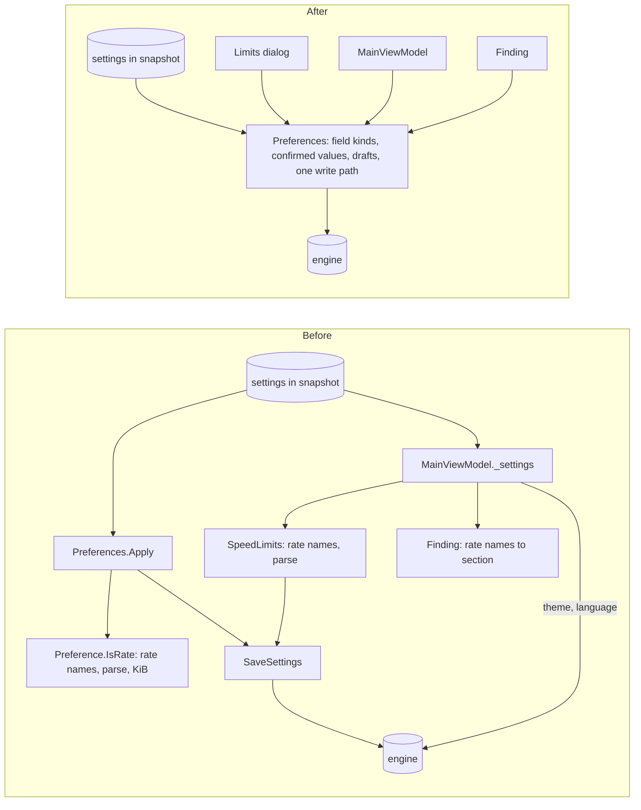
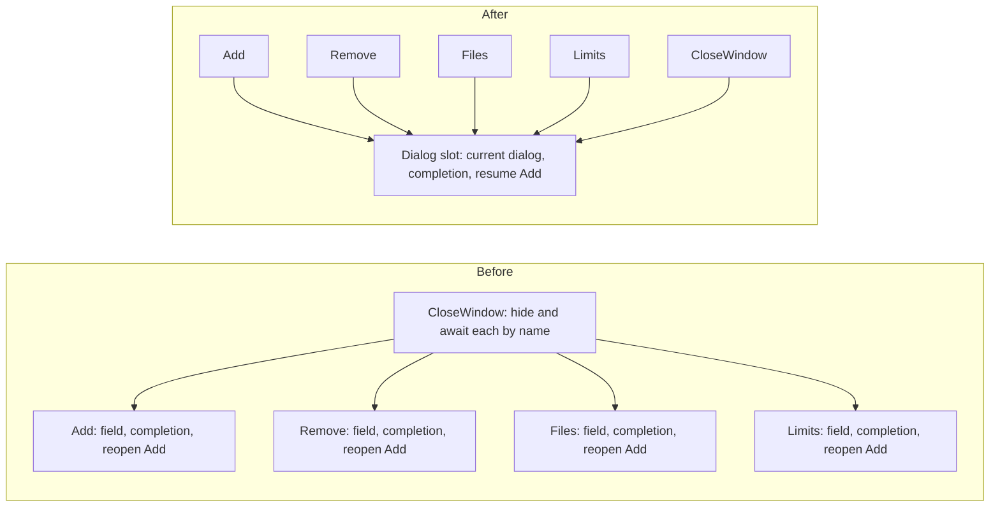
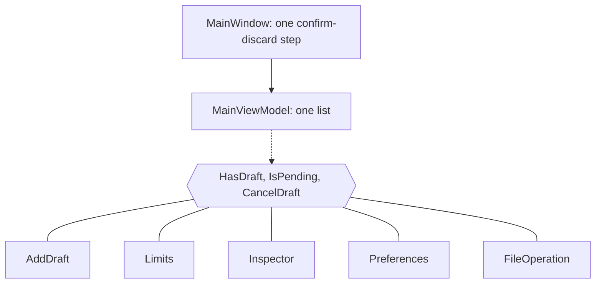
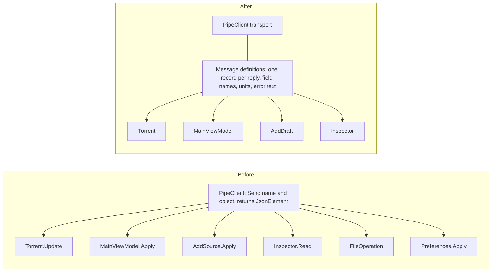

# Architecture review: product WinUI app

[The consolidated architecture](consolidated.md) replaces these proposals. This
file keeps the first review as evidence.

Review of `app/src`, 2026-10-06. It proposes changes that put each rule in one
module, so that a change or a bug touches one place. A deep module does a lot
behind a small interface. A shallow module has an interface almost as large as
its code.

The proposals keep the project's decisions in
[architecture](../../architecture.md#command-and-presentation-flow) and
[testing](../../testing.md#what-earns-a-test):

- The view models call one concrete `PipeClient`, without a service interface.
- No interface or public member is added only so that a test can reach code.
- Dialog lifetime and native pickers stay in the view.

These modules are already deep, and the review leaves them alone:

- the `PipeClient` transport, `Inspector`, `FileSelection`, `FileOperation`
  and `Placement`
- the preview lifecycle in `AddDraft`
- `PeriodSpan` and `Week`
- `Torrent` rows and the TableView seam

| # | Proposal | Strength |
| --- | --- | --- |
| 1 | [Make Preferences the one settings module](#1-make-preferences-the-one-settings-module) | Strong |
| 2 | [One dialog slot in MainWindow](#2-one-dialog-slot-in-mainwindow) | Strong |
| 3 | [One contract for unfinished input](#3-one-contract-for-unfinished-input) | Worth exploring |
| 4 | [Define pipe messages once on the C# side](#4-define-pipe-messages-once-on-the-c-side) | Decided against in #12 |
| 5 | [Move source intake into the Add flow](#5-move-source-intake-into-the-add-flow) | Speculative |

**Do proposal 1 first.** Settings are where the code is changing now. The
speed-limit rules have no single owner, so their copies can drift apart.
Proposal 1 extends `Preferences`, which already exists, and deletes one module.

## 1. Make Preferences the one settings module

**Files:** `Views/Preferences.cs`, `SpeedLimits.cs`, `MainViewModel.cs`
(`Apply`, `ChangeLanguage`, `SelectTheme`), `MainViewModel/Actions.cs`
(`Setting`, `Limit`, `SaveSettings`, `SaveLimits`), `MainViewModel/Finding.cs`,
`Views/PreferencesForm.xaml.cs` (`Navigate`).

**Problem:** engine settings have two readers and several writers.

- `MainViewModel` keeps the raw settings JSON in `_settings`. It reads
  `show_add`, `theme`, `language` and `alternative_limits` from that JSON.
  `Preferences.Apply` also confirms the same settings into `Preference`
  objects.
- The four speed-limit names are listed in `SpeedLimits.Choices`,
  `Preference.IsRate` and `Finding.cs`.
- The KiB conversion is in `MainViewModel.Limit`, `SaveLimits` and
  `Preference.Confirm`.
- `SpeedLimits.Apply` and `Preferences.TryValue` contain the same number
  parse.
- Most writes go through `SaveSettings`. `ChangeLanguage` and `SelectTheme`
  send `settings` directly and keep their own pending flag,
  `_settingsPending`.

**Solution:** `Preferences` owns every confirmed setting and every rule for
parsing and checking a value. It also makes every write. Each field states its
kind as a type: rate, count, port, ratio or text. Code does not check the
field name to find the kind. The Limits dialog binds to the four rate fields and
applies them together. `MainViewModel` stops keeping the raw settings JSON.
`SpeedLimits` is deleted.

**Design point to settle:** the Limits dialog saves four values together, but
the Settings page saves one field at a time. The new interface must support
both.

**Gains:**

- A change to one setting touches one file.
- The rate rules cannot drift apart.
- The Settings page, the Limits dialog and Finding use one interface.
- The parse and unit rules can be tested through `Preferences`.

## 2. One dialog slot in MainWindow

**Files:** `MainWindow.cs` (`ShowAdd`, `CloseWindow`), `MainWindow/Actions.cs`
(`ShowRemove`, `ShowFiles`, `ShowLimits`, `HasDialog`), `MainWindow/Chrome.cs`
(`RefreshDialogs`), `MainWindow/Capture.cs`.

**Problem:** WinUI shows one `ContentDialog` at a time, but the window tracks
four dialogs separately. Each dialog has a field and a completion source:
`_addDialog` with `_dialogClosed`, `_removeDialog`, `_filesDialog` and
`_limitsDialog`, each with its own `Closed` source. The rule "reopen Add when an
addition is unfinished" is copied in the `finally` blocks of `ShowRemove`,
`ShowFiles` and `ShowLimits`, and again in `CloseWindow`. `CloseWindow` hides
and awaits each dialog by name. A fifth dialog means editing four places.

**Solution:** one slot holds the open dialog. It sets `HasDialog`. It completes
when the dialog closes, and then it resumes an unfinished Add. `CloseWindow`
hides and awaits only that slot. Dialog lifetime stays in the view.

**Gains:** four field pairs are deleted. The resume rule is written once. The
close path stops naming dialogs.

## 3. One contract for unfinished input

**Files:** `MainViewModel.cs` (`CanClose`, `HasDraft`, `CancelDraft`, `Publish`,
`Refresh`), `Views/AddDraft.cs`, `SpeedLimits.cs`, `Views/Inspector.cs`,
`Views/Preferences.cs`, `Views/FileOperation.cs`, `MainWindow/Workspace.cs`,
`MainWindow/Actions.cs`, `MainWindow.cs`.

**Problem:** five owners hold unsaved user edits, and each one names the idea
differently.

| Owner | Has unsaved input | Discard |
| --- | --- | --- |
| `AddDraft` | `HasChanges` | `Cancel()` |
| `SpeedLimits` | `HasChanges` | `Begin()` |
| `Inspector` | `HasDraft` | `CancelDraft()` |
| `Preferences` | `HasDraft` | `CancelDraft()` |
| `FileOperation` | `HasDraft` | `Cancel()` |

`MainViewModel` lists these owners by hand in six members. The view repeats
"confirm discard, then cancel" four times: when the inspector closes, when the
selection changes the inspector target, when the user leaves Settings, and when
the window closes.

**Solution:** the owners share one small interface: has unsaved input, is busy,
discard. `MainViewModel` keeps one list of them. The view has one
confirm-discard step.

**Gains:** a new editor joins in one place, and closing the window cannot skip
a draft.

**Note:** [architecture](../../architecture.md#command-and-presentation-flow)
forbids a "service interface". This interface is not a service. It has five real
implementations and no test double. If proposal 1 deletes `SpeedLimits`, it has
four.

## 4. Define pipe messages once on the C# side

**Files:** `Services/PipeClient.cs`, `Models/Torrent.cs` (`Update`),
`MainViewModel.cs` (`Apply`, `FormatError`), `MainViewModel/Actions.cs`
(`Detail`, `ReceiveSources`), `Views/AddDraft.cs`, `Views/Inspector.cs`,
`Views/FileOperation.cs`, `Views/Preferences.cs`, `App.cs`.

**Problem:** [the protocol contract](../../protocol.md) says "Define each
message's fields, units, and limits once". On the C# side,
`Send(string, object)` returns a `JsonElement`. About nine callers read field
names from that raw JSON. The rule that turns a failure into error text
(`error is CommandFailure ? error.Message : Text.Error("unknown", ...)`) is
copied in `MainViewModel.FormatError`, `AddSource`, `Preference` and `App`.
The transport also knows product names: `snapshot`, `activate`, `close` and
`sources`. If a field is renamed, the compiler does not catch it.

**Solution:** one module turns each reply and each snapshot into a typed record.
It also turns each failure into error text. Callers read typed values. The
transport stays as it is. The engine side made the same change in commit
3c1d765.

**Gains:**

- The compiler catches a renamed field.
- The error-text rule is written once.
- The transport stops knowing product names.
- Sample frames can test the reader, as [testing](../../testing.md) asks for
  the pipe contract.

**Prior decision:** issue #12 proposed the same change and was closed on
2026-10-05 as not pursued. The reasons were: the issue named no failure that a
user sees, a renamed reply key fails the first time its screen runs, and the
engine side (#92) already declares each key once. This proposal gives no new
user-visible failure, so it does not reopen #12.

## 5. Move source intake into the Add flow

**Files:** `MainWindow.cs` (`PickSources`, `ShowAdd`), `MainWindow/Actions.cs`
(drop and paste), `MainViewModel/Actions.cs` (`AddSources`, `ReceiveSources`),
`Views/AddDraft.cs` (`AcceptMagnet`).

**Problem:** sources reach the Add flow by four routes: the picker, drop and
paste, the "more files" button, and the engine. The view filters `.torrent`
files in the picker and again for drop and paste, and it splits pasted text
into lines. The view writes `IsAddOpen`, and `AddDraft` reads it back through
`MainViewModel`.

**Solution:** every route gives raw sources to `AddDraft`. `AddDraft` filters
them and owns whether the Add dialog is open.

**Gains:** one intake rule, and the open state has one owner.

**Why it is speculative:** the duplication is small. The main gain is that it
supports proposal 2.

## Evidence

A sub-agent read `app/src` and traced Pause and Add from the gesture to the pipe
and back. The duplicated rules named above were checked in the source on
2026-10-06. The view models have no automated tests. The only automated check of
app behavior is the capture review in the `MainWindow` partials, and it runs
against a real engine.
