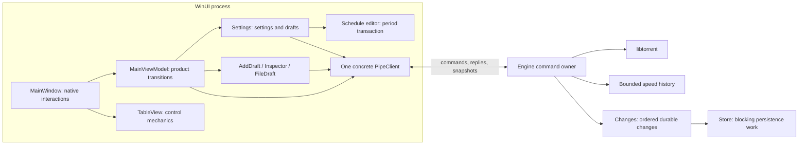

# Proposed architecture

Consolidated on 2026-10-06 from twelve architecture review documents and the
owner's subsequent decisions. This folder is self-contained: it preserves the
selected architecture, useful evidence, rejected alternatives and delivery work
without requiring the original review folders. Source checks started at
`8e92ce9` and included the changing working tree; historical findings are not a
claim about what remains unimplemented today.

This proposal preserves the selected refactoring plan at that checkpoint;
superseded presentation and workflow choices are historical, not a second
backlog or authority for current work.
The [active contracts](../../README.md) own required behavior, including the
settled owner rulings; implementation updates the relevant source maps and
records its evidence against those contracts.

Implementation from `db6ec1d` is tracked in the
[checkpoint](evidence.md#implementation-checkpoint); the
[current source map](../../architecture-current.md) describes the implemented
owners. Historical deletion targets below are not a second backlog.

Follow the [root instructions](../../../AGENTS.md) for current implementation
decisions; the delivery document preserves the earlier sequencing and rationale.

- This document describes the target and its reasons.
- [Decisions](decisions.md) accounts for the input reviews, including rejected
  recommendations and corrections to their reasoning.
- [Delivery](delivery.md) gives the implementation order, deletion targets,
  contract changes and appropriate evidence.
- [Evidence](evidence.md) preserves the source traces, earlier measurements,
  verification limits and implementation handoff details worth retaining.
- The [GitHub issue map](delivery.md#github-issue-map) accounts for all sixteen
  review issues, #112–#127, including dependencies and partially adopted scope.

## Keep the product boundaries

Keep the native engine, on-demand WinUI process, one local pipe, and reusable
TableView. The engine continues transfers independently of the interface and
owns durable torrent state. WinUI owns presentation and unfinished input.
TableView owns generic control mechanics. These boundaries have different
lifetimes and concrete jobs; replacing them adds work without simplifying the
person's task.

This diagram shows ownership and principal calls, not one required class per
box. Keep private operations private; do not create interfaces, projects or
pass-through services to make the diagram literal. Preview-source and payload
work retain their existing separate Store execution lanes so slow work does not
hold up durable commits.

| Owner | Owns | Leaves elsewhere |
| --- | --- | --- |
| Engine | Torrent membership, accepted operations, legality, saved choices and effective outcomes | Presentation drafts and native dialog lifetime |
| MainViewModel | Accepted product selection, navigation consequences, command availability, connection presentation and source admission | Control mechanics, field parsing and engine policy |
| Settings | Confirmed settings, field input, validation/conversion and settings submission | Native controls and catalogue preparation |
| Schedule editor | Period collection, period draft, schedule submission and its outcome | Timeline geometry, pointer capture and engine scheduling policy |
| AddDraft / Inspector / FileDraft | Their concrete draft, target, pending operation and recovery | A universal editor protocol |
| MainWindow and views | Dialogs, pickers, focus, chrome, binding and native interaction | A second accepted selection or settings model |
| PipeClient | Framing, correlation, reconnect and command/read scheduling | Draft policy and torrent operations |
| TableView | Source capture, view order, control selection, gestures and virtualization | Torrent eligibility, queue policy and persistence |
| Strings | Prepared catalogues, text/formatting and shared error-to-text conversion | Product operation state |

## One settings surface and owner

All speed-limit entry points open Settings at Transfers and focus the relevant
field. Remove the separate Limits dialog and `SpeedLimits` draft. The search and
scheduler paths already point toward Settings; maintaining a second editor gives
one setting two interaction models and repeats parsing and presentation state.
This implements the owner's decision now recorded in
[the interface contract](../../interface.md#main-window).

`Settings` becomes the UI authority for confirmed settings and intended
changes. The engine remains the durable authority. Remove MainViewModel's raw
`_settings` cache and readers that duplicate setting values. Commands, search
targets, Add defaults and views read the same confirmed fields.

Each field declares its value kind and Settings category once. Use a small enum
and ordinary parsing code, not a class per kind or a generated settings schema.
Rate conversion, finite/range checks and display conversion have one owner;
field-specific constraints such as a valid port remain explicit. A wire key is
an identifier, not the way the application discovers the field's meaning.

Settings writes use the Settings submission path, including alternative-limit
commands and theme changes. That path sends only intended fields and requests
confirmed state through the existing pipe. It does not need another request
queue or a global lock that prevents independent fields being edited.

Keep the saved alternative-limit setting distinct from the engine's effective
mode, which includes the schedule and its temporary override. An explicit mode
command still reaches the engine when its value equals the saved setting:
selecting normal limits must override a currently alternative schedule. Sharing
submission does not make a saved-value equality check valid for that command.

Language retains its special interaction: prepare and publish the newest local
catalogue before waiting for persistence, coalesce rapid choices, and report
unsaved state honestly. Settings owns the selected/saved setting and its
submission; the existing MainViewModel.ChangeLanguage path can retain catalogue
preparation, publication and latest-choice coordination, calling the shared
settings submission operation. Do not relocate that orchestration merely to make
all settings look identical or replace it with ordinary save-then-display
behavior. Theme can use ordinary
confirmed-setting behavior. A shared `_settingsPending` flag must not make a
theme save block an unrelated language choice.

### Submitted input is not the current draft

Fix [#112](https://github.com/SynoSoftware/TinyTorrent2/issues/112) before or as
the first slice of settings consolidation. Capture the submitted choice; when
its reply arrives, update the confirmed value without replacing input entered
after submission. A small field-local edit generation can distinguish those
edits if comparing values is insufficient. It is not a protocol revision or a
new concurrency framework. Keep input editable and focused while saving, as the
interface contract requires. Do not auto-submit newer text on acknowledgement.
Selecting a discrete choice or pressing Enter is a commit gesture. If a save is
pending, retain the latest explicitly committed value and submit it when that
save settles; later typing alone must not replace that intent. Keep this within
the field's existing submission lifetime, without a general-purpose queue.
Disconnection retains unfinished intent for recovery; reconnect does not replay
it automatically, as the interface contract requires.

Leaving Settings or closing the window is a commit boundary for valid ordinary
field input, not a reason to offer Discard first. Await relevant pending saves
and then continue the requested navigation; do not lose a Back click just
because departure started a save. Recheck remaining drafts after awaiting.
The [committing-edits ruling](../../interface.md#committing-edits) owns the
different outcomes for invalid ordinary input, refused saves and explicit editor
drafts. When a refusal cancels departure or close, restore normal command
admission without automatically retrying the failed value. IME composition and
explicit Cancel must not submit partial text.

Coordinate this with close admission: a CanEdit-gated commit cannot be called
after closing has disabled it, and saving retained fields must not reopen
admission to unrelated commands or incoming sources. Keep that ordering explicit
in the existing presentation/close owners.

### Give the schedule its own transaction

Move period state and behavior together into one concrete owner under
Settings. A source-only partial-file move would improve navigation but leave
the same unrestricted state sharing. A real owner earns its place here because
the schedule submits a whole period list and has its own draft, error and pending
lifetime. Keep ordinary settings fields outside that transaction.

The schedule owner uses the same settings submission path. `PeriodSpan` owns
time arithmetic. Draft field edits and pointer edits converge on one coherent
mutation/notification path; a pointer update should not briefly publish half a
time span. Week owns gesture and drawing state, with no mirrored schedule model.

## One complete modal lifetime

MainWindow holds one active dialog interaction, including its native dialog and
completion. Use private members, or a small private value if needed to keep the
dialog, completion and resumption together. No public dialog service, registry,
queue or editor hierarchy is needed. Microsoft's
[ContentDialog guidance](https://learn.microsoft.com/en-us/windows/apps/develop/ui/controls/dialogs-and-flyouts/dialogs)
allows only one open dialog per window, supporting this single-slot design.

Completion means the entire interaction has settled: submission where applicable,
visual detachment and event cleanup. Native dialog occupancy can end before
that interaction completes. Keep unrelated dialog admission and deferred Add
blocked until the enclosing operation settles. Current Save actions need no
nested confirmation: Delete has no editable draft, and its existing dialog is
already the destructive confirmation. Preserve that confirmation without adding
unused dialog nesting. Ordinary window members express these two lifetimes. `ShowAsync`
returning is not enough when the operation continues afterward. Otherwise closing
can race unfinished work that the existing Remove path waits for.

Closing suspends the active interaction, protects unfinished input, and either
finishes closing or restores the still-valid editor. Restoration also happens
when close cancellation or another awaited operation fails; it must not depend
on a flag set only after a successful reply. Preserve the actual suspended
editor rather than guessing it solely from which owners have drafts. Several
drafts may exist, and Remove is a confirmation rather than an editor.

The unfinished-input prompt uses the freed slot and implements the
[Save/Discard/Cancel ruling](../../interface.md#committing-edits) through each
concrete editor's existing action and outcome. No generic save interface or
second implementation of the action is needed.
Scope the choice to the identified editor, then recheck remaining draft owners
before closing so saving one editor cannot discard another owner's input.

Common theme/flow updates address that
slot; dialog-specific content and commit behavior stay beside the dialog. One
deferred-Add decision runs after the current interaction settles and closing is
no longer suppressing presentation. Draft state survives view recreation.

The window owns visibility. AddDraft owns preview acquisition and withdrawal;
the window informs it when presentation starts or stops. Keep closing/source
handoff admission in MainViewModel, where readiness and connection are known.

Tracking: [#115](https://github.com/SynoSoftware/TinyTorrent2/issues/115).

## Accept selection and inspector changes together

MainViewModel is the single owner of accepted product selection and its inspector
consequence. The window proposes a control selection, shows a native discard
prompt when required, and reflects the accepted selection. Delete its rollback
copy. Direct commands and reveal actions use the same transition.

The transition checks pending work and target changes before committing product
selection. After an asynchronous prompt it rechecks connection, membership and
target identity. Inspector keeps its local invariants, but callers consume its
accept/refuse outcome instead of changing selection and ignoring a failed close.

Keep three meaningful concepts distinct:

- TableView's control selection and focus over the visible projection.
- The model's accepted command targets, reconciled with confirmed membership.
- Inspector's target and draft, which can remain visible as unavailable after
  removal or survive a hidden page.

TableView's pruning of invisible/deleted rows does not replace product membership
reconciliation. In particular, the product cannot depend on a loaded control
event to invalidate a removed command target. Filtering is not deletion, and a
retained draft must not attach to a new torrent merely because hashes match.

Keep aggregate close checks explicit over concrete draft owners. A universal
`IDraft`/navigation guard would hide different discard scopes behind a shared
name without removing the decisions.

Tracking: [#116](https://github.com/SynoSoftware/TinyTorrent2/issues/116).

## Separate connection facts from operation feedback

Keep transport connection, last confirmed engine status, startup/presentation
readiness and local closing work distinct. Derive command writability from the
facts instead of maintaining `_writable` as another answer.

Do not replace all current flags with one enum merely because flags exist.
`_ready` currently records that startup state has been presented; it is not the
same as permission to write. Disconnection can coexist with retained last-known
engine facts, and local closing is independent of engine stopping. A displayed
connection phase can be derived in one place without erasing those distinctions.

Connection/recovery feedback has its own reason and severity. Command failure
is a separate, dismissible outcome; never append an old operation error to a
new disconnection message. Field failures stay at the field. Put the repeated
exception-to-text rule in Strings so every caller formats the same failure
consistently without moving operation state into the text owner.

Follow the interface's [feedback placement policy](../../interface.md#feedback-placement).
If a concrete event needs transient in-app feedback, the window owns one overlay
host shared by its pages; each operation still owns its result and recovery.
Use native controls and accessible presentation without adding an event bus,
notification service hierarchy or per-page hosts. Do not build an unused host
merely to complete this architecture. Desktop notifications keep their existing
engine/tray owner and runtime; this refactor does not migrate them to WinUI
AppNotification or duplicate their delivery.

Related review tracking: [#20](https://github.com/SynoSoftware/TinyTorrent2/issues/20).
The old issue descriptions may reference superseded members; implement against
current source.

## Publish meaningful changes, once

Keep complete snapshots, stable Torrent row instances, background pipe parsing
and dispatcher-owned presentation. Change the amount of work caused by a
snapshot, not the protocol or threading model.

| Change | Work it should trigger |
| --- | --- |
| Transfer telemetry | Row values, counters and one table reconciliation for active sorting/eligibility; no recursive refresh of all child owners |
| Membership, filter or source queue order | One completed visible projection publication and selection reconciliation |
| Accepted selection / pending operation | Relevant inspector transition and command availability |
| Setting confirmation | Changed confirmed fields, preserving drafts; no unrelated schedule redraw |
| Period, draft, schedule availability or selection | Schedule notifications and visible timeline drawing |
| Language | One prepared publication, translated/formatted content and necessary geometry updates |
| Theme or geometry | Affected visual work, without reapplying settings or rebuilding torrent membership |

Use two presentation paths: a window-only notification for ordinary snapshots,
selection and filtering, and the existing broader propagation when connection,
access or language changes affect child owners. An empty-property notification
on one small owner is acceptable. The duplication to remove is routine recursive
refresh of every child, not every broad notification. Settings detects changes
to its confirmed fields, and draft edits notify their actual consumers.

Keep ordinary Torrent row notification and per-snapshot command refresh initially.
Do not add general per-row comparison machinery, cached last snapshots or
dependency maps. Replace the second queue JSON read with a comparison of the
row's old/new reorder eligibility (`Queue >= 0`) across its update. A torrent
can leave the queue without moving in the visible sequence, while the table's
global CanReorder remains true. Retain that batch signal: when no source was
published, refresh once for changed eligibility or an active non-Queue sort.
The table's no-change path can avoid native churn while retaining required
gesture cancellation.

MainViewModel owns membership as an ordered list with a dictionary index. These
are two useful representations under one owner, not competing authorities. Use
a plain list instead of an unobserved ObservableCollection, but preserve its
stable order for equal QueueOrder values. Do not substitute dictionary enumeration
as an ordering guarantee. Inspector asks that owner for identity/instance
membership rather than searching the list. Move removed-target handling to
membership reconciliation, where the fact is known, instead of projection.

Global search uses Query to find commands and torrents; it does not filter the
table on each keystroke. Remove the unused Search filter state after checking
current callers, and correct the English and Spanish empty-state text that still
tells the person to clear search. Compute projection after snapshot row updates
and explicit filter changes: a changed torrent status can change eligibility
without changing membership or queue position. Start placement at its existing
ready transition rather than on every model event.

Keep daily update checking alive. ObserveUpdates currently supplies the periodic
opportunity for CheckUpdates to notice its one-day deadline. Call it explicitly
once per applied snapshot, and react promptly when the update setting changes;
remove its accidental invocation on every Settings event. Moving it only to
the setting-change event would stop subsequent daily checks in a window that
stays open. Reuse the existing deadline and in-flight guard, not another timer.

### Publish a completed table projection

For [#113](https://github.com/SynoSoftware/TinyTorrent2/issues/113), construct
the desired projection from the existing row instances and publish one source
change when membership/order actually differs. Use a read-only list property:
compare the desired sequence, assign it only when changed, and notify that
property. Bind ItemsSource OneWay. This needs no new collection type and fits the
[TableView source contract](../../../lib/TableView/docs/tableview-contract.md#53-source-identity-and-update-contract).
The library retains its own incremental native-view reconciliation; replacing
the host list does not require resetting the native ListView. Do not add a new
TableView transaction API or another app-side reconciler.

Do not replace the source on every telemetry tick. Source publication and
RefreshView can cancel row drag, so unchanged membership/order must not produce
a source update. RefreshView covers active non-Queue sorts and changed reorder
eligibility, including under Queue sorting. A source publication already
performs reconciliation, so do not also refresh it for that same batch.
Queue order remains the host's
natural sequence and TableView owns user-selected display order. Their two sorts
serve different meanings and cannot simply be deleted as duplicate code.

Verify the attached table path: the earlier bare-collection timings do not
measure source capture, binding, selection reconciliation or native containers.
One publication removes known redundant work; it does not establish a latency
claim. Microsoft's
[list performance guidance](https://learn.microsoft.com/en-us/windows/apps/develop/performance/optimize-gridview-and-listview)
supports preserving virtualization and limiting element cost; it does not dictate
the application's projection protocol.

### Draw the scheduler only for its inputs

For [#114](https://github.com/SynoSoftware/TinyTorrent2/issues/114), use the
existing schedule/text signals, geometry and theme changes. Make unchanged
Settings snapshots quiet and stop refreshing Settings from every parent
snapshot. That removes the periodic hidden redraw at its source, without adding
a page-visibility gate or hidden dirty state. A genuine schedule change can
update a loaded hidden control. Retain existing load/unload lifetime and the
availability/target checks that cancel invalid gestures. Add visibility-specific
work only if meaningful hidden cost remains after these simpler changes.

Retain the current separation of grid and period drawing. Keep simple element
reuse local to Week. Do not delete it solely because no benchmark accompanies
the diff, and do not add multiple pools solely against a hypothetical future
property leak. Make initialization complete and obvious; simplify reuse only
when the resulting gesture remains responsive and the code becomes clearer.

Inspector polling keeps its existing concrete lifetime and invalidation rules.
Do not stop reads because a section looks static unless its contract says its
data cannot change. Apply the established stable-row pattern to peers and
trackers within Inspector, using the existing endpoint/URL identity and updating
rows in place. This avoids replacing every bound row on each reply; it needs no
second cache service. Verify the visible effect before claiming a flicker fix.
Scope those rows to the current session, torrent and detail context; reject stale
replies and clear/reconcile them when that context changes. The same endpoint or
tracker URL in another torrent does not identify the same presentation lifetime.
Bind General's downloaded/remaining display to the target Torrent's formatting
owner instead of keeping equivalent Inspector formatting getters.
For large file trees, notify changed leaves and affected ancestors if focused
evidence identifies that path as the remaining cost. Keep Pieces handling simple.

### Make visible responses stable and prompt

TableView should apply a confirmed source reorder immediately when sorting by
its DefinesRowOrder column. Keep settling for live value sorts. This is an
intentional amendment to the current blanket settling rule in contract section
9: the host has already decided the queue order, so delaying it makes repeated
Move commands appear ineffective. It is not permission to optimistically claim
an engine reorder before confirmation.
Land projection batching first: otherwise Move to bottom still emits a rebuild
per displaced row, and removing the settling hold makes each one more expensive.

A rebuild whose rows and effective selection need no native change should not
move focus to the ListView and back or toggle its selection mode. Still perform
logical eligibility/selection reconciliation, source acceptance and required
gesture cancellation. Same order alone is insufficient when instances or
eligibility changed. Keep this optimization inside TableView; the app must not
repair library focus churn. Source inspection identifies the unnecessary work;
automation-event and focus observation establish its actual user effect.
When a real reorder needs a focus handoff, restore the row that actually held
physical focus, not whichever row is current or selected; those can differ.

Keep variable rate text from shifting adjacent status controls. Follow the
existing [#48 decision](https://github.com/SynoSoftware/TinyTorrent2/issues/48):
separate fixed-width download/upload fields, still grouped with Alternative
limits, with connectivity trailing. The speed graph's scale label sits above
the plot, right-aligned, so its changing width cannot shift the plot sideways.
Keep those groups. Rate allocations grow with Windows text size, and available
width determines when the rates stack and trailing groups move below. Current
rate values never determine layout. Check field widths with both languages and
text scaling rather than reserving room for speculative status items.
`MinWidth` alone is not a stable allocation: longer text can still grow it.
Verify the chosen layout at narrow window widths as well as changing rates.

Retain current row-arrival/departure animations and live-sort settling behavior
until a focused visual comparison supports changing settle animation separately.
The platform review's instant-settle choice is reasonable, but animation
mechanics and the existing control contract require more than a source guess.

## Let binding remove mechanical synchronization

Use native binding for simple control values and translated text where it removes
manual assignments. Preserve explicit event handling for asynchronous validation,
discard prompts, focus and gestures. TwoWay binding alone cannot accept/refuse a
selection transition safely.

Keep catalogue publication as one deliberate notification path. Strings currently
swaps an internal catalogue without implementing `INotifyPropertyChanged`, but
the existing Publish path notifies its presentation owners. Retain that language
notification while narrowing routine snapshot propagation, then migrate one
representative page or dialog and check live switching. Do not add a second Strings
notification system if the existing path updates the generated bindings correctly.
If it does not, correct notification at that owner instead of restoring per-tick
refresh. Microsoft's
[function-binding documentation](https://learn.microsoft.com/en-us/windows/apps/develop/data-binding/function-bindings)
supports string arguments and function-name change notification; compilation
alone does not prove the application's refresh path.

Keep explicit menu reconstruction and table-header updates where necessary.
Remove `x:Name` only when nothing still needs it for focus, automation or events.
Use shared styles/templates only where repeated rows have the same behavior;
avoid a metadata-driven settings engine.

For numeric editors, retain NumberBox when stepping and numeric behavior serve
the interaction. Where arbitrary unfinished text must survive and the application
disables numeric validation, prefer a normal TextBox bound to that draft over
reaching into NumberBox's private template. Choose per field and preserve useful
keyboard behavior; fewer helper lines do not justify a blanket loss of stepping.

## Share the complete committed torrent edit

Keep tracker merge and explicit Edit as separate entry points, with their own
validation and legality. Within ordered engine execution, one private operation
derives intended facts from current accepted state, commits when necessary,
applies changed fields and completes the reply at the correct time.

That operation removes duplicate commit/apply reasoning, not just a call to
`replace_trackers`. A small intended-edit value can distinguish an absent field
from an explicit empty tracker list. It must not be a second complete torrent
model, a generic patch framework or an internal JSON request.

Preserve one durable commit for combined tracker/priority edits. Effective file
priorities can settle later or partly fail: keep their reply until the outcome
is established and do not promise rollback. Saved equality can avoid a write
without proving that effective state already matches. Keep merge's current
legality instead of silently routing it through Edit's moving-torrent guard.

Changes retains ordered product changes; Store retains blocking I/O. No second
queue or repository layer is needed.

Tracking: [#117](https://github.com/SynoSoftware/TinyTorrent2/issues/117).

## Encapsulate only genuinely cohesive engine state

Put speed-history buffers, partial-minute accumulation, retention and range reads
in one concrete value. The engine supplies time/rates and owns cadence and
session identity. Preserve the algorithm and wire result. Do not pass the whole
Engine::State into the new owner.

This contained extraction is worthwhile for readability but lower priority than
input recovery and hot-path duplication. It is not a mandate to split additions,
file operations, checkpointing and shutdown into managers that all borrow State.
Likewise, retain the existing concrete read scheduling instead of inventing a
generic polling framework.

Tracking: [#118](https://github.com/SynoSoftware/TinyTorrent2/issues/118).

## Keep diagnostics proportional

Keep in-process pixel capture where the platform requires it. Parse diagnostic
mode selection once and adapt direct callers when an owner changes. Retain
journeys that protect input, files, identity or lifecycle outcomes; an old report
of a fixed bug is not a replacement for valuable regression coverage.

Remove redundant layout sweeps or obsolete implementation-specific journeys
after applying the [testing policy](../../testing.md), not by a line-count quota.
Do not create a separate automation product or public test-only interfaces.
Capture sources are included only with `EnableCapture=true`, so diagnostic
activation and window setup are absent from the ordinary executable. The opt-in
build uses a separate output directory; [testing](../../testing.md) records how
to pair its launcher and engine. This is a source inclusion boundary, not a new
automation framework or a measured performance claim.

## Scope of this proposal

This consolidation changes documentation only. It does not certify the evolving
working tree, reproduce the reported failures, or establish performance gains.
No product build, test suite, desktop launch or benchmark was performed.
Implementation should follow the finite [delivery plan](delivery.md), updating
active contracts where behavior changes and removing superseded paths in each
completed slice.
