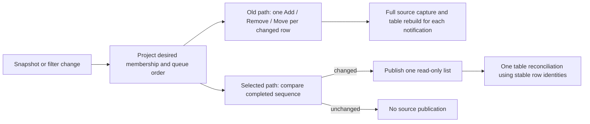

# Evidence and verification limits

This is the useful evidence retained from the twelve reviews consolidated on
2026-10-06, plus the implementation reports supplied afterwards. It supports
the [selected architecture](README.md) and [delivery plan](delivery.md), rather
than introducing another backlog. [Decisions](decisions.md) records what was
accepted, narrowed or rejected. The original review folders are not required.

The source traces describe the inspected baseline, starting at `8e92ce9` and
including concurrent edits. Some paths have since changed. A source trace
establishes an operation or risk; it does not establish a reproduced failure,
its frequency or its latency. Earlier timings below are reported evidence from
the linked issues, not measurements performed by this consolidation.

## Implementation checkpoint

Architecture implementation began from `db6ec1d` on 2026-10-06. The current
working tree includes concurrent Add, splitter and torrent-option work; those
changes are outside this architecture review's completion claim.
The architecture commit separates those changes using the Git index. Build and
runtime evidence below describes the combined implementation tree at the time
of each check; the separated commit received source review without another
build or test run.

| Delivery slice | Implemented ownership |
| --- | --- |
| 1 — Settings | `Preferences` owns fields, conversion, adapter choices and submission, including confirmed theme/language; `Schedule` owns period drafts and whole-list saves. Shared departure handles invalid input and refusal. |
| 2 — Modal lifetime | One `DialogInteraction` covers display, submission and cleanup. Close resolves concrete editors and restores the actual unresolved suspended editor. |
| 3 — Selection and feedback | One model transition accepts selection and inspector consequences. Membership reflection retains unavailable drafts. Connection and command messages remain separate across pages; `Strings.Error` and `Torrent.IsError` own their common rules. |
| 4 — Publication and drawing | One changed projection publication, independent reorder eligibility, narrow routine refresh, relevant schedule signals, stable peer/tracker rows, fixed status-rate widths and guarded physical-focus handoff. |
| 5 — Bindings | Touched Add, Inspector, Files and file-browser text uses bindings with explicit live-language refresh; native focus and commits remain direct. Menu hints and OEM queue keys use the registered native accelerators. |
| 6 — Committed edits | One private native `CommitEdit` serves explicit edits and tracker merges without changing their admission rules. |
| 7 — History | `SpeedHistory` owns buffers and aggregation; engine cadence and session identity remain unchanged. |
| 8 — Diagnostics | Capture mode is parsed once. Removed duplicate Limits capture, smoke Settings layout sweep, obsolete invalid-input retention and form-instance assertions. Details mode runs its existing behavior journey directly; full layout and files matrices remain available. |

No new overlay host was warranted by the existing event callers: app conditions
use app-level messages, editor errors stay local, and engine desktop notifications
keep their existing path. There is no duplicate notification runtime.

Adversarial source review covered all eight slices and found issues in mutable
cell binding, deferred focus, membership reflection, field departure and suspended
editor recovery. Those findings were corrected and rereviewed. Source review is
not runtime or release acceptance.
The designated colleague, **Review consolidated architecture**, additionally
found omitted adapter and shortcut ownership changes and hidden preference
drafts left by non-Settings commands. These were corrected and rereviewed; the
first source-review verdict was **0 standards blockers, 0 specification blockers**.
The owner requested another adversarial pass in that colleague's chat; the
renewed review found and verified the corrections described below.
Commands now save through `Preferences` without creating ordinary field drafts:
theme and alternative-limit failures use command feedback, while Add owns its
own failure. Direct Settings edits retain their local failed input. The unused
language toggle command and its resource keys were removed. This approval covers
the selected architecture, not the release acceptance limits below.

The renewed review found two further obligations: TableView must restore physical
row focus before publishing `SelectionChanged`, so host handlers keep control;
and deferred Add admission must run after a cancelled draft decision as well as
an accepted one, so acknowledged external sources cannot remain unseen. Both
were corrected in their existing owners, without additional interaction state.
Normal refusal resumes deferred Add; a caught display or cleanup exception
reports its failure without automatically retrying the same dialog. Independent
reviewers reread these fixes and found no remaining concrete architecture blocker.

The focused `CommittedFiles` check passed using the owned disposable store in
`artifacts/evidence/CommittedFiles-d6aa70d7-0097-4c79-82fa-d3aedd5fc913`: compound
priority/tracker persistence and explicit tracker clearing survived restart.
The ten edit journeys passed in
`artifacts/evidence/UiSelfCapture-571588c8-d1ee-426d-879a-217ea6dd7384`, including
newer input, explicit queued save intent, invalid field/page departure and all
three schedule departure choices. The added field-departure case guards the
specific defect that page departure coverage missed.

After the final shared-confirmation change, all ten edit journeys passed again
in `artifacts/evidence/UiSelfCapture-1afbdb85-bb62-46d9-9dfd-c210a2ce543a`
(6.1 seconds inside the app). Two preceding attempts passed the confirmation
cases but stopped on a schedule capture selector: repeated template visuals
shared automation IDs, and x:Bind did not supply the assumed DataContext.
The capture now obtains the current day from its owning repeater's realized
item mapping; the native Toggle and resulting draft assertions remain.

The focused details journey passed in
`artifacts/evidence/UiSelfCapture-282b9755-0b71-45b1-bfe6-6e63eb0736c5` (2 seconds
inside the app): a live language switch retained tracker text and native focus,
and tracker, file-priority and ordinary preference choices applied. The narrowed
recovery journey passed in
`artifacts/evidence/UiSelfCapture-f32b5717-76c4-40a0-809c-71e498bc9eaa` (14 seconds):
removing a torrent preserved its unavailable inspector draft with Save disabled
and Cancel available. These checks use real offscreen XAML, not physical input.

Close/recovery passed in
`artifacts/evidence/DesktopCapture-378338c1-9188-4efd-ade1-e84f7caa92d1`: twelve
cancelled Exit cases preserved Add input across language, theme and size; failed
Save restored its input, field error and focus; reconnect retained the tracker
draft. The launcher also verified history advancing after the UI exited. An
earlier attempt exposed a layout cycle in concurrent Add-pane sizing. Replacing
its measured-width feedback with star columns preserved that dialog's design and
allowed the same journey to pass. All processes these checks launched were closed.

Both Release targets compiled with zero warnings/errors. Native compilation
matched changed-header dependents; managed compilation stayed in the affected
app/TableView assemblies. A later concurrent wire-field change required refreshing
the engine paired with the app after a focused launch exposed the mismatch.
No full suite or transfer check ran. The prescribed Everything output-directory
check could not connect to its service; a filesystem walk excluding `artifacts/`,
`3rdParty/` and `.git/` found no generated output folders elsewhere.

The final coherent app build is `artifacts/architecture-settled-build.log`,
with zero warnings/errors. It compiled the app and reused current TableView and
Lucide outputs; TableView's final focus fix compiled in
`artifacts/architecture-adversarial-build.log`. Concurrent Add XAML edits between
that build's passes caused a checksum warning, resolved by the coherent build.
Those Add changes are preserved; compiling them does not expand this review's
scope into acceptance of that separate UI work. No source was newer than the
final app binary when the focused edit check ran.

Release acceptance remains separate: the earlier 300-torrent automation-provider
failure was not rerun as a broad matrix, and these checks do not establish native
physical-input/automation behavior, Narrator, High Contrast, transfer throughput
or measured responsiveness. Untouched Move-editor restoration and rare native
storage/history boundaries have source review rather than new runtime evidence.
The existing issues retain those broader acceptance obligations.

### Advisory follow-up review

A further reviewer questioned theme edits through Settings versus the title bar,
TableView's native automation selection integration (#40), diagnostic code in
the product window, and editor-specific close recovery. These are advisory
concerns, not owner rulings or accepted implementation requirements. Their
suggested changes still need a concrete failure or simplification benefit and
comparison with the existing owners. The implementation checkpoint records an
improvement; it does not declare every ownership concern settled.

## Settings and editors

| Finding at review time | Evidence and implication |
| --- | --- |
| Settings rules were scattered | `MainViewModel._settings` and `Preference` objects both represented confirmed values. Rate names and section mapping appeared in Preferences, Finding and SpeedLimits; parsing appeared in two editors and KiB conversion in several readers/writers. Rate writes already converged through SaveLimits, so the problem was duplicated interpretation and ownership, not four independent persistence implementations. |
| Theme and language interfered | SelectTheme and ChangeLanguage shared `_settingsPending`; a theme save could disable language selection or suppress its confirmation. Preserve language's prepare/publish/coalesce behavior while moving saved-value ownership and submission to Preferences. |
| Acknowledgement could erase newer input | `Preference.Accept` assigned `_input = _confirmedInput` unconditionally. Separate the value submitted from the draft now being edited. Submit 100, then type 200: acknowledgement of 100 must leave 200 intact. If Enter commits 200 while 100 is pending, then 300 is typed without submission, preserve 200 as explicit intent and 300 as draft. Reconnection must not replay either automatically. |
| Back could lose its intended action | OnFieldDeparture committed only when focus stayed inside the form; Navigate rejected departure while Preferences.IsPending. Merely adding a save could still consume Back without navigating. Await relevant submission and continue the original transition only on success, following the owner ruling for invalid or refused input. |
| Schedule is a real transaction | Preferences combined ordinary Fields and a period draft in HasDraft, and field/registration/schedule work in IsPending. The schedule submits a whole period list with its own error and pending lifetime. A concrete schedule owner earns its place; a file-only move does not. Reviewable substeps within the Settings pass avoid temporary competing submission and notification paths. |
| Dialog closure was shorter than its interaction | Remove awaited its command after native closure before signalling completion. Completing the logical operation at ShowAsync alone would allow closing to race submission and cleanup. Native occupancy and logical completion remain distinct; current Save actions need no nested confirmation, and Delete keeps its existing confirmation. |
| Failed close could hide an unfinished editor | CloseWindow hid dialogs before awaiting later work. `keepDraft` was set only after CancelClose succeeded; an exception before then could leave the live window without the editor. Restore the actual suspended, still-valid interaction independently of successful protocol replies. This was source reasoning, not a reproduced failure. |
| Selection acceptance was spread across owners | Workspace kept a rollback selection and prompted; MainViewModel assigned product selection and retargeted Inspector; Inspector could refuse, and a close outcome was ignored. One accepted transition removes that coordination. TableView selection, product membership and a retained unavailable inspector draft remain different facts. |
| Global text refresh did unrelated work | Opening Add, Files or the discard prompt could call window-wide RefreshText, which also rebuilt menus and refreshed the torrent table. Populate the concrete dialog or its bindings without that global work. |

The settled behavior lives in
[Committing edits](../../interface.md#committing-edits), not in a historical
review's open questions. Save/Discard/Cancel uses the concrete editor's existing
action and delete confirmation. A choice concerns that editor; closing then
rechecks the remaining owners. Invalid ordinary Settings input, valid input
refused by the engine, and an explicit editor draft have different outcomes.

The Settings review also found repeated failure formatting in App,
MainViewModel, AddSource and Preference; different torrent-error predicates in
counts, selection feedback and filtering; and separately maintained shortcut
registration and menu hints. Those are bounded caller migrations in the
[decision table](decisions.md#disposition-of-all-proposal-groups), not reasons
for a command framework. Search current callers before removing the historical
SwitchLanguage command, language keys or template-access helpers.

## Snapshot and table updates

PipeClient already read and parsed replies off the UI thread. QueueSnapshot
coalesced dispatcher delivery. The amplification began after presentation
accepted the snapshot, not at the transport boundary.

The table retains its native incremental reconciliation in either case; a new
host list is not a Reset sent to the native ListView.

| Source trace | Why it matters |
| --- | --- |
| Project moved each desired row into its index; moving the first of N rows to the bottom could emit N − 1 Move notifications. | Each notification made Source copy the list and Table rebuild its view. Membership changes could also force a full sort. Moving one row down was therefore much more expensive than moving it up. |
| Completing torrents mapped their negative engine queue position to `int.MaxValue`. | A completed row could travel into the seeding group through the same many-Move path without a user gesture. First load and filter changes likewise published many source updates. |
| RebuildView validated and ordered rows, reconciled the view and selection, queried realized containers, refreshed visuals and managed native focus/selection. | Bare collection timings omitted most of the attached-control work. Batch at the host; the library already supports assigning one completed source. |
| QueueColumn declared DefinesRowOrder, but ViewOrder applied the settling interval to every selected sort. | Repeated confirmed Move commands within the interval could display the new Queue number before the row moved. The first change could be immediate and later ones delayed. This is a response-delay mechanism, not a CPU measurement. |
| Settling held many intermediate reorder notifications. | Removing its Queue exemption first would expose more expensive sorting/reconciliation for the old many-Move sequence. Publish once before removing the hold. |
| A non-Queue snapshot called RefreshView even when held order produced no native moves. | Unconditional focus handoff and toggling ListView.SelectionMode could cause unnecessary focus/selection events. Observe the effect; equal order alone does not rule out changed instances or eligibility. |
| RebuildView cancelled row drag on rebuild/source acceptance. | A historical comment saying cancellation occurred only after order moved was misleading. Keep contract section 5.3 behavior, including when batching source changes. |
| The row reorder predicate reads `Queue >= 0`, independently of visible order. | With downloading rows A,B,C, completing C can leave A,B,C unchanged and global CanReorder true. Row binding notification does not refresh TableView's cursor or cancel its drag. Preserve eligibility invalidation when removing the duplicate queue read. |
| Stable OrderBy used Torrents as its input. | Equal QueueOrder values, including completed torrents, inherited that list's stable order. The dictionary is an identity index, not a replacement ordering authority. |
| Global search bound Query, while the old table Search property was only cleared. | The initial claim that every search keystroke reprojected the table was wrong. Removing dead Search also requires correcting empty-state text in both catalogues. |

`Torrent.Update` notified realized row bindings. The reviews counted roughly
20 bindings per realized row; this does not mean all torrent rows have live
containers. Preserve virtualization. Per-row comparison machinery and a stored
last snapshot were not selected as prerequisites for fixing source publication.

## Other update paths

Preferences.Apply and parent Refresh both refreshed preferences, and field
confirmation also notified fields. Week reacted to broad Preferences events;
ordinary field typing could therefore redraw the schedule. The retained fix is
quiet unchanged confirmation and relevant schedule signals, followed by removing
routine parent-to-child refresh. A collapsed page can stay loaded; that alone
does not justify a visibility gate or prove hidden layout cost.

Keep the useful ongoing schedule changes: PeriodSpan arithmetic, coherent
PeriodDraft.SetSpan edits, the draft's own label, grid redraw separated from
period redraw, a stable tooltip element and the unchanged-span guard during
drag. Snapping limits distinct positions, not how often a person can move back
and forth. It cannot prove a maximum of 96 redraws per drag. Local element
reuse still needs complete initialization; neither speculative extra pools nor
blanket removal was selected.

ObserveUpdates was reached through Preferences events, while CheckUpdates
enforced a one-day deadline. Restricting the trigger to preference changes would
stop daily checking in a long-lived window. Retain one snapshot opportunity and
prompt enable/disable handling using the existing deadline and in-flight guard.
StartPlacement already ran at the ready transition; its repeated call from
OnModelChanged was a separate redundant path.

Inspector constructed new Peer and Tracker objects per reply. Stable keys
allowed reconciliation, but new instances still caused realized content and
bindings to be replaced. Stable instances should be scoped to the current
session, target and detail context. Actual flicker was inferred, not observed.
General duplicated formatting for downloaded/remaining values already owned
by Torrent. File-tree notification changes remain deferred to a demonstrated
remaining cost; static-looking sections do not authorize stopping their reads.

The status bar placed variable-width rate text before the Alternative and
Errors toggles; minimum widths do not guarantee stable layout at larger values
or text scales. Keep #48's chosen rate grouping and stable allocations. The
graph's former Auto-width label column has since been removed: its scale label
now sits right-aligned above the plot, so changing label width cannot move the
plot sideways. The old label-column sizing recommendation is superseded.

Other inspected calls do not create new work items: ShowFiles used UpdateLayout
on resize; UpdateChrome could run from several size/root/window events per resize
step; OS calls included adapter enumeration, shell launch and engine restart.
Their frequency is not uniformly "once per action", but the reviews did not
establish a remaining input stall requiring another scheduler or thread.

## Native transactions and history

MergeTrackers in [Commands](../../../engine/src/Engine/Commands.cpp) and
explicit Edit in [Details](../../../engine/src/Engine/Details.cpp) each derived
saved facts, committed them, applied tracker/priorities changes and tracked
resume-state persistence. A wrapper around replace_trackers would leave most
of that duplicate decision intact. A second save-and-callback abstraction would
repeat what Changes already does.

The selected common operation runs inside existing ordered execution. It
preserves absent versus explicitly empty tracker choices, one durable combined
tracker/priority commit, saved versus effective state reconciliation and the
retained reply for asynchronous priority completion. Merge and Edit keep their
own preparation and legality: routing merge through Edit's Act guard would
silently add its moving-torrent refusal. Do not construct an internal JSON
request just to call the other entry point.

The same distinction between saved and effective state matters for settings.
[Settings](../../../engine/src/Engine/Settings.cpp) applies an explicit
alternative_limits override even if saved settings compare equal, and
[Policy](../../../engine/src/Engine/Policy.cpp) derives effective mode from the
schedule and override. A generic preference equality early return must not
swallow a user's request for normal mode during an alternative schedule.

[History](../../../engine/src/Engine/History.cpp) operated on second/minute
buffers, a partial-minute accumulator and a count in the general Engine::State.
Those facts form one bounded algorithm. Supply time/rates to a concrete history
owner; preserve retention, gap handling and partial-minute output. Cadence and
engine-session identity stay with the engine. This is different from #89's
previously rejected cleanup of constants.

Changes orders accepted document changes. Store performs blocking work and
delivers completions. Its separate durable, payload and preview-source lanes
prevent slow source reads from holding up unrelated writes or payload work.
These are different responsibilities, not competing persistence authorities.
Summary, preview and inspector reads similarly share PipeClient scheduling
while retaining different demand and withdrawal lifetimes.

## Earlier measurements

These are the results quoted by the reviews, with their original workload
limits. They are not performance budgets or evidence that current code passed.

| Prior issue | Reported evidence | Limit on interpretation |
| --- | --- | --- |
| [#105](https://github.com/SynoSoftware/TinyTorrent2/issues/105) | Bare ObservableCollection, 10,000 rows: about 7 ms unchanged; 191 ms for reversal with 9,999 notifications. | No TableView attached. Does not price full source capture, sorting, native containers, focus or selection. Keep the completed optimization; #113 addresses a different cost. |
| [#106](https://github.com/SynoSoftware/TinyTorrent2/issues/106) | Release window, generated paused torrents without peers: at most 3.5 ms per refresh with Inspector closed/on General; Files opening stall 82–257 ms, then 14–27 ms per refresh for the large file case; Pieces at most 4 ms after initial display. | Does not represent active peers, changing values, every library size or Settings after opening. Does not prove which suboperation caused Files time. The UI round-trip probe cannot establish visual motion or focus-event noise. |
| [#107](https://github.com/SynoSoftware/TinyTorrent2/issues/107) | Adapter enumeration 14–27 ms; engine Process.Start about 7.5 ms; File.Move about 1 ms. | These observations did not justify moving all native calls off the UI thread or explain periodic jitter. Revisit only a concrete remaining stall. |
| [#111](https://github.com/SynoSoftware/TinyTorrent2/issues/111) | Detail queries reported small in the measured workloads, including General at 6 ms or less. | Extreme torrents and real peers were not comprehensively covered. No general asynchronous detail-query owner was justified. |

The old WM_NULL / SendMessageTimeout probe was temporary and is not a repository
tool. If timing remains necessary, use available profiling or a small temporary
probe outside the product. Compare the same attached-control workload before
and after, recording torrent count, active/paused state, sort, inspector section
and whether Settings has been opened. A short run covering startup, a bulk filter
change and Move to bottom distinguishes source amplification from ordinary ticks.
Measurements inform the result; they do not gate a clear deletion of duplicate
work or establish visual correctness.

Related closed decisions remain context: [#12](https://github.com/SynoSoftware/TinyTorrent2/issues/12)
declined a blanket typed codec, [#13](https://github.com/SynoSoftware/TinyTorrent2/issues/13)
settled close/source admission, and [#103](https://github.com/SynoSoftware/TinyTorrent2/issues/103)
kept replaceable optional reads behind commands. No review requires reopening
them. Typed values remain useful when they remove repeated interpretation;
they do not automatically validate keys across the process boundary.

## Verification still needed

Use the [delivery evidence](delivery.md) and [testing policy](../../testing.md)
to select checks for the slice actually changed. Preserve the existing
Exit/Keep-input, search-to-Settings, tracker-draft reconnect, file-operation,
committed-file and merge/restart outcomes where applicable. Historical test-file
line numbers and private member names are not a permanent harness interface.

- Binding: generated-code inspection supported constant-string function
  arguments and parent publication. Verify a representative compile and live
  language change, including dialogs, headers, menus, accessible names and
  focus. Literal ComboBoxItem SelectedValuePath behavior was not established;
  retain working selection synchronization until its replacement is verified.
- Table: inspect one publication with the control attached, then unchanged
  telemetry, non-Queue sorting, confirmed repeated queue moves, drag cancellation,
  selection retention and physical focus. Focus/automation event observation
  answers a different question from timing. Keep existing animations unless
  a separate visual comparison justifies changing them.
- Layout: check changing values, English/Spanish, supported text scaling and
  narrow windows. The reported 170-pixel rate minima are implementation choices,
  not validated sizing requirements. Keep the graph scale label above the plot.
- Recovery and transactions: a failed save, refused selection, removed target
  during a prompt, reconnect or storage refusal must not lose input, retarget a
  draft or report an uncommitted change as saved. Existing behavior checks are
  more useful than tests of helper shape or file placement.

The later implementation report said projection publication, Queue settling and
status layout compiled with zero warnings/errors, but no runtime launch occurred.
Treat that as reported compilation of its then-current tree, not completion of
#113, #125 or #48. Concurrent source edits and commits mean current status belongs
in the [existing issues](delivery.md#github-issue-map), not a copied checklist.

The report also attributed unrelated recompilation to generated assembly Git
metadata after HEAD changed. That explains possible build fan-out but does not
measure or settle its cost. Follow the repository's build-log review rule when
building; do not require another build merely to validate these documents.

No builds, tests, desktop launches or benchmarks were performed to create this
consolidation. The earlier HTML report's unverified rendering and CDN setup have
no bearing on implementation and are not dependencies of this folder.
