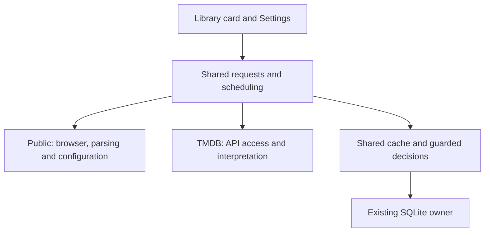

# Movie websites

**Public websites** is one video information provider, selected instead of TMDB.
Its Configure dialog selects **Website** (IMDb or Rotten Tomatoes) and
**Delay (seconds)**. No account or key is required. The providers are exclusive:
choosing Public websites stops TMDB requests, and choosing TMDB stops website
requests. The plugin uses only the chosen website, without automatic fallback.

It uses an installed browser; TinyTorrent embeds and distributes no browser,
browser runtime, driver or automation package.

## Requests and saved information

Opening Library, importing files, searching the table and scrolling through rows
never request these websites. A request starts from the movie's explicit lookup
action, or after its empty information pane has remained visible for the provider's
configured number of seconds. Changing selection, hiding the information pane,
leaving Library, opening a dialog, deactivating or closing the window cancels
that pending delay. Zero means
manual requests only; the initial delay is five seconds.

Both triggers use one lookup owner and one in-flight request. A failed or
ambiguous attempt is recorded and does not retry itself when the person reopens
the details or restarts TinyTorrent. The person can request it again.
Automatic lookup requires an unambiguous movie title and, when known, matching
release year; a search result alone is not an identification.

A validated result is saved in the existing SQLite database together with its
source identity, complete extracted movie data and retrieval time. Keep the
validated source payload as well as the fields used for display and search, so
a later display need does not require another website request. Multiple current
files identified as the same source movie reuse one saved result. Library reads
that saved information on subsequent visits. There is no age-based expiry,
startup refresh, periodic request or automatic refresh of a partial result.
Only **Refresh details** requests a saved movie again. An immediate **Fetch details**
on an empty entry can reuse another entry's validated result; bypassing the dwell
or retrying a failed attempt does not itself require refreshing saved data. A failed refresh
preserves the previous result. Current membership and identification are checked
again when committing, so a late reply cannot restore a removed entry or undo a
later identification decision. Existing contribution cleanup owns retention.

The details card offers **Fetch details** immediately when empty and
**Refresh details** when populated; neither action waits for the delay. It shows
progress and a localized inline outcome. A website refusal leaves local Library
search and file actions available. Configuration uses the existing native dialog
owner and NumberBox, with keyboard navigation and the application's theme.

## Browser access

**Owner ruling: use the user's installed browser as it is, with no additional
installation.** The owner rejected a companion extension and a CAPTCHA handoff
as requirements for this feature. A fresh headless profile does not meet the
intended existing-session behavior.

An ordinary Windows URL launch cannot return page contents to TinyTorrent.
The mechanism for reading the existing browser session remains unresolved;
do not treat launching a URL as proof of extraction or promise uninterrupted
website access. The shared [network route](architecture.md#network-route)
governs browser access too. The current reader cannot honor a configured proxy
or selected network adapter, so it rejects those routes before launching.
It runs only when the shared HTTP owner confirms unrestricted direct access;
a route change cancels the operation and terminates its browser process.
A refusal stops the request and preserves cached information.

Chrome's [remote-debugging policy](https://developer.chrome.com/blog/remote-debugging-port)
requires a separate data directory from version 136 onward. That supported
automation route does not preserve the required default browser session.

Native Windows UI Automation read the visible body of a task-owned fixture in
the normal Chrome session. It did not retrieve the hidden movie JSON-LD needed
by this provider. A complete existing-session reader is therefore unfinished;
visible page text alone is insufficient evidence of movie extraction. These
experiments remain outside production code.

Site access permission remains subject to the existing
[provider release requirements](library.md#privacy-and-provider-release-requirements).

## Implementation status

**Owner ruling: this delivery is a removable proof of concept.** Website blocking
does not prevent its completion. Completion requires contained implementation,
compilation and verification of local requests, cache and native UI behavior.
Record actual access outcomes and browser limitations; experimental evidence is
not a shipping guarantee.

**Owner steer, 2026-10-09: settle the current prototype and stop testing.** Keep
the compiled implementation and its existing evidence. Further browser
experiments, site probes, builds and capture runs are outside this delivery.
This closes the experimental work; it does not establish a working
existing-session reader or shipping readiness.

The current reader launches installed Edge or Chrome headlessly with a fresh
temporary profile per page. This remains a known mismatch with the browser
ruling above. No extension, browser installation or embedded runtime was added.
The native UI Automation experiment is not wired into this reader.

| Area | Established result |
| --- | --- |
| Rotten Tomatoes | Bounded Chrome probes returned search results and movie data. Production parsing of the saved pages verified title, 1994 release year, synopsis and cast. |
| IMDb | The probe returned 403 Forbidden without movie data. No retry or refusal bypass was attempted. |
| Normal browser session | Native UI Automation read fixture body text with the foreground unchanged. Hidden JSON-LD readback was not achieved. The earlier managed UI Automation result did not establish that page text was unavailable. |
| Configuration and details | Native Website/Delay dialog, Information/File selector and Fetch button verified in English/Spanish and Light/Dark. |
| SQLite and requests | Catalogue isolation, full cached records, durable failed attempts, failed refresh preservation and stale-decision guards passed. |
| Containment | Public-specific production behavior stays in `Library/Public/`, with one source registration outside it. |

The final Debug x64 capture build passed with zero warnings and errors. The log
is `artifacts/library-subtitles-containment-build.log`; its assembly SHA-256 is
`A3C43A51179E16B332EF4C789568FBCCFB17C94705DB4896189B924FA163A046`.
All 21 native journeys passed in
`artifacts/evidence/Capture-library-files-06c67b06-83d5-4d16-89be-b5d0e5db61d5`.
They made no provider requests. Persistence checks passed before the UI-only
fixes against assembly SHA-256
`9CBD19AF66358C1A51405DB7D75CB2D6E3E50EAD7C333553E1E7A9C304B4EE9E`.
Browser fixture evidence remains under `artifacts/evidence/browser-session/`;
identified fixture windows were closed. No production code changed during the
final browser experiments or settlement. The later network-route gate has
source review only; the recorded binaries and runtime results predate that gate.

## Implementation owners and verification

The [Library implementation chat](codex://threads/01a11e09-3e87-7133-9f38-440c0f302151)
owns shared request, cache, scheduling and presentation code. Public owns its
browser reader, parsing and configuration. Existing implementation and evidence
are the settled prototype; unresolved normal-session transport is a recorded
limitation, not a request to restart testing.

## Boundaries

The [replaceable provider contract](library-implementation.md#replaceable-movie-providers)
owns the interface and migration. Public contains only its provider, installed
browser reader, typed settings and configuration body. TMDB has its own provider
folder. Neither provider owns Library membership, current decisions or storage
transactions.

Library owns provider selection, cancellation, scheduling, guarded completion,
normalized saved information and complete raw records. UI commands and dwell
use that same request owner; the existing window dialog owner hosts each
provider's optional editor. Public declares on-demand scheduling. The shared
scheduler rejects it before enumerating background work, and Public exposes no
batch-population method.

This uses compile-time composition in the existing app. There is no discovery
registry, runtime loader, new project or engine feature.

## Removing the proof of concept

Source inspection finds one production registration outside Public. Removal is:

1. Delete `app/src/Library/Public/`.
2. Remove the Public provider alias and its provider entry in
   `MainViewModel/Features.cs`.
3. Remove the `websites` sections from both localized resource files.
4. Remove the Public parser fixtures from `SourceChecks.ps1`, supplying ordinary
   synthetic VideoInformation for the shared cache checks that use their result.
   Remove the on-demand provider-controls journey from `CaptureLibraryFiles.cs`
   if no replacement on-demand provider is registered.
5. Compile the app and verify saved information remains readable.

The source dependency scan passed. The Library owner accepts that trace and the
combined compilation as containment evidence; a separate removal-only build is
not a delivery requirement. Shared request, UI and storage code has no Public
namespace dependency and remains in place. Keep the catalogue-isolation,
stale-decision and payload tests as shared behavior.

If the removed provider was selected, Library resolves no active provider and
disables enrichment until the person selects an available provider. It continues
to read saved information without silently selecting another remote provider.
`Helpers/ShellAssociation.cs` remains shared with ordinary file association
lookup. There is no installed dependency to uninstall.

The [implementation stage](library-implementation.md#6a-public-websites-movie-source)
owns the remaining delivery checks. Site access remains subject to the
[provider release requirements](library.md#privacy-and-provider-release-requirements).
